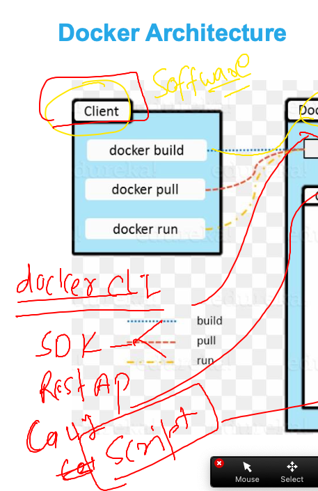
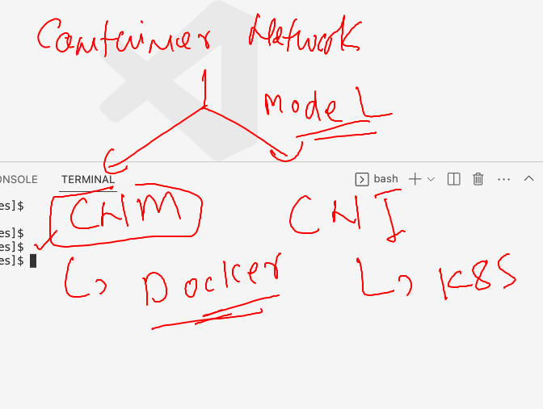
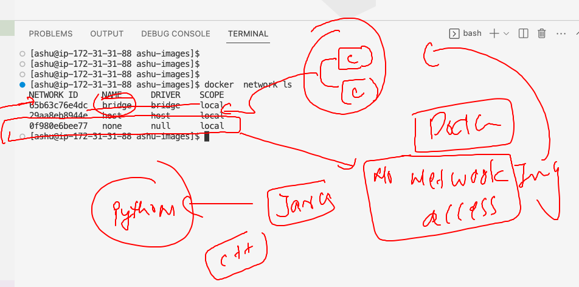

## Docker Revision -- freshing 

### Container vs vm 


### Isolation and resources limits in containers using Namesapce & contorl groups 


### labs -- 


### Installing docker in any LInux platform 

### checking linux kernel -- 3.10==>

```
[ec2-user@ip-172-31-31-88 ~]$ uname -r
6.1.21-1.45.amzn
```

### Docker ce vs docker ee


### Installing Docker ce on rhel|centos|oraclelinux|amazonlinux

```
[root@ip-172-31-31-88 ~]# yum install docker 
Last metadata expiration check: 0:03:23 ago on Mon Apr 17 04:43:55 2023.
Dependencies resolved.
==========================================================================================================================
 Package                            Architecture       Version                              Repository               Size
==========================================================================================================================
Installing:
 docker                             x86_64             20.10.17-1.amzn2023.0.6              amazonlinux              39 M
Installing dependencies:
 containerd                         x86_64             1.6.19-1.amzn2023.0.1                amazonlinux              31 M
 iptables-libs                      x86_64             1.8.8-3.amzn2023.0.2                 amazonlinux             401 k
 iptables-nft                       x
```

### starting docker engine service 

```
[root@ip-172-31-31-88 ~]# systemctl start  docker 
[root@ip-172-31-31-88 ~]# systemctl status  docker 
● docker.service - Docker Application Container Engine
     Loaded: loaded (/usr/lib/systemd/system/docker.service; disabled; preset: disabled)
     Active: active (running) since Mon 2023-04-17 04:59:01 UTC; 5s ago
TriggeredBy: ● docker.socket

```

### checking docker installation and conenct

```
[ashu@ip-172-31-31-88 ~]$ docker  version 
Client:
 Version:           20.10.17
 API version:       1.41
 Go version:        go1.19.3
 Git commit:        100c701
 Built:             Mon Mar 13 22:41:42 2023
 OS/Arch:           linux/amd64
 Context:           default
 Experimental:      true
Got permission denied while trying to connect to the Docker daemon socket at unix:///var/run/docker.sock: Get "http://%2Fvar%2Frun%2Fdocker.sock/v1.24/version": dial unix /var/run/docker.sock: connect: permission denied
[ashu@ip-172-31-31-88 ~]$ 


```

### adding ashu user in docker group

```
usermod -G  docker ashu 
[root@ip-172-31-31-88 ~]# 
[root@ip-172-31-31-88 ~]# grep docker  /etc/group
docker:x:992:ashu
[root@ip-172-31-31-88 ~]# 

```

### setting up image build environment 

```
[ashu@ip-172-31-31-88 ~]$ whoami
ashu
[ashu@ip-172-31-31-88 ~]$ docker  -v
Docker version 20.10.17, build 100c701
[ashu@ip-172-31-31-88 ~]$ ls
[ashu@ip-172-31-31-88 ~]$ mkdir ashu-images
[ashu@ip-172-31-31-88 ~]$ ls
ashu-images
[ashu@ip-172-31-31-88 ~]$ mkdir ashu-images/java
[ashu@ip-172-31-31-88 ~]$ mkdir ashu-images/python
[ashu@ip-172-31-31-88 ~]$ mkdir ashu-images/webapp
[ashu@ip-172-31-31-88 ~]$ ls
ashu-images
[ashu@ip-172-31-31-88 ~]$ ls  ashu-images/
java  python  webapp
[ashu@ip-172-31-31-88 ~]$ 

```

## Image building options 


### Dockefile for image building purpose 

### python code -- ashu.py 

```
import time

while True:
    print("Hello all , welcome to python..!!")
    time.sleep(3)
    print("Welcome to Oracle India ..")
    time.sleep(2)
    print("Welcome to Containers By Docker..!!")
    print("______________________")
    time.sleep(3)
```

### Dockerfile

```
FROM python 
# we are targetting python docker image from docker hub registry 
LABEL name=ashutoshh
LABEL email=ashutoshh@linux.com 
# OPtional field but you can use to share image developer details to user
RUN mkdir /mycode 
# inside existing python image i am creating a directory 
# RUN you are asking for shell access 
COPY ashu.py /mycode/
# copy is an instruction to copy code into /mycode/
CMD ["python","/mycode/ashu.py"]
# CMD is to define process (single process) 
# when you create container from this image it will start this process
```

### lets build image

```
[ashu@ip-172-31-31-88 ashu-images]$ ls
java  python  webapp
[ashu@ip-172-31-31-88 ashu-images]$ docker build  -t  ashupy:v1     python/ 
Sending build context to Docker daemon  3.584kB
Step 1/6 : FROM python
latest: Pulling from library/python
b0248cf3e63c: Pull complete 
127e97b4daf7: Pull complete 
0336c50c9f69: Pull complete 
```

### checking image 

```
[ashu@ip-172-31-31-88 ashu-images]$ docker images
REPOSITORY   TAG       IMAGE ID       CREATED              SIZE
tejsh        v1        c787061f0590   About a minute ago   921MB
hemapy       v1        280b1df192f4   About a minute ago   921MB
naveenpy     v1        5e976659fa2c   About a minute ago   921MB
ishanpy      v1        52a47ec4b348   2 minutes ago     
```

### creating containers 

```
[ashu@ip-172-31-31-88 ashu-images]$ docker  run  -it  -d  --name ashuc1  ashupy:v1  
a4b08906be729aee12521e61608b27fd48971b35397ae807e319aaa58b4524f2
[ashu@ip-172-31-31-88 ashu-images]$ docker  ps
CONTAINER ID   IMAGE       COMMAND                  CREATED         STATUS         PORTS     NAMES
a4b08906be72   ashupy:v1   "python /mycode/ashu…"   3 seconds ago   Up 2 seconds             ashuc1
```

### checking output 

```
ashu@ip-172-31-31-88 ashu-images]$ docker logs  ashuc1 
======>
Hello all , welcome to python..!!
Welcome to Oracle India ..
Welcome to Containers By Docker..!!

```

### getting access with container running shell

```
ashu@ip-172-31-31-88 ashu-images]$ docker  exec -it ashuc2  bash 
root@f147be1bd5f3:/# 
root@f147be1bd5f3:/# 
root@f147be1bd5f3:/# whoami
root
root@f147be1bd5f3:/# id
uid=0(root) gid=0(root) groups=0(root)
root@f147be1bd5f3:/# cd /mycode/
root@f147be1bd5f3:/mycode# ls
ashu.py
root@f147be1bd5f3:/mycode# exit
exit
```

### stop and remove containes  -- images

```
[ashu@ip-172-31-31-88 ashu-images]$ docker  kill ashuc1 ashuc2
ashuc2
Error response from daemon: Cannot kill container: ashuc1: Container a4b08906be729aee12521e61608b27fd48971b35397ae807e319aaa58b4524f2 is not running
[ashu@ip-172-31-31-88 ashu-images]$ docker  rm ashuc1 ashuc2 
ashuc1
ashuc2
[ashu@ip-172-31-31-88 ashu-images]$ 
[ashu@ip-172-31-31-88 ashu-images]$ docker rmi ashupy:v1 
Untagged: ashupy:v1
Deleted: sha256:e5279d701ffde12a5bbdaae8dc5136cf2f2c7defca8ad03a8df09df2e0114a20
Deleted: sha256:c9d953930d8a7884cb4704a000a625fa78ab25b32834a3cb38d4b9056ca02140
Deleted: sha256:6abdc4ede8bcdf2888fbc720e4bb6fc2095d2a99ca8a4139b1204ddba34beec4
[ashu@ip-172-31-31-88 ashu-images]$ docker rmi ashupy:v2 
Untagged: ashupy:v2
Deleted: sha256:b8334865f02538bd16a1ab701d34b99fd803fe215ed31d02af04716d1227b548
Deleted: sha256:042bc45d495ee88b704bbe6085221ad1f8fcd44ecb30db34d5f4e0dec76fb1f0
Deleted: sha256:055c6e021a81ec4445a56637986f8a7b934f11c4cc5cddd0bb03c435b51ee8ac
Deleted: sha256:d7d9325a018e181679f9bb0613b7afc03c71ba278af39429d0d1733fdc5f3279
Deleted: sha256:307a4c014ae5f2bbb9861f8dd5e191f880df1fa12de27be130807364a0cabd28
Deleted: sha256:77f1c8563ffc57ee580123d38c61f2051985c9787992746299acbb75420f2f48
[ashu@ip-172-31-31-88 ashu-images]$ 
```

### alpine docker python image 

```
FROM alpine 
LABEL name=ashutoshh
RUN apk add python3 && mkdir /code 
ADD https://raw.githubusercontent.com/redashu/pythonLang/main/while.py /code/
# copy vs add is add for copy data from URL 
RUN chmod 644  /code/while.py && adduser -D jack 
# adding jack user
USER jack 
# calling jack user 
ENTRYPOINT python3 /code/while.py 
# REplacement of CMD and also having few difference 

```

### building it 

```
[ashu@ip-172-31-31-88 ashu-images]$ ls
java  python  webapp
[ashu@ip-172-31-31-88 ashu-images]$ docker build -t  ashutask:v1 -f python/alpine.dockerfile  python/ 
Sending build context to Docker daemon  4.608kB
Step 1/7 : FROM alpine
 ---> 9ed4aefc74f6
Step 2/7 : LABEL name=ashutoshh
 ---> Running in 5f96acd97747
Removing intermediate container 5f96acd97747
 ---> 477a52813996
Step 3/7 : RUN apk add python3 && mkdir /code
 ---> Running in efaf9058aa43
fetch https://dl-cdn.alpinelinux.org/alpine/v3.17/main/x86_64/APKINDEX.tar.gz
fetch https://dl-cdn.alpinelinux.org/alpine/v3.17/community/x86_64/APKINDEX.tar.gz
(1/13) Installing libbz2 (1.0.8
```

### checking images 

```
[ashu@ip-172-31-31-88 ashu-images]$ docker images
REPOSITORY     TAG        IMAGE ID       CREATED              SIZE
ashutask       v1         24881dc3deab   About a minute ago   58.8MB
```

### creating contaienr 

```
[ashu@ip-172-31-31-88 ashu-images]$ docker run -itd --name ashucc2 ashutask:v1 
2b833d281943afc6b8eb9620e1242af65d334e859ea793913742835fb325635f
[ashu@ip-172-31-31-88 ashu-images]$ docker  ps
CONTAINER ID   IMAGE                  COMMAND                  CREATED          STATUS          PORTS     NAMES
2b833d281943   ashutask:v1            "/bin/sh -c 'python3…"   2 seconds ago    Up 1 second               ashucc2
57011795cc78   saivisalalp:pycodev1   "python3 /pycodes/sc…"   9 minutes ago    Up 9 minutes              saivisal_a1_c1
57b2ea720aa9   ishanalp:pycodev1      "python3 /pycodes/is…"   13 minutes ago   Up 13 minutes             ishanc1
e3176d982c81   tejsh:v3               "python /mycode/tejs…"   20 minutes ago   Up 20 minutes             tejsh
[ashu@ip-172-31-31-88 ashu-images]$ docker logs ashucc2
Hello all , welcome to python..!!
Welcome to LnB..
Welcome to Containers ..!!
______________________
```

### verify user

```
[ashu@ip-172-31-31-88 ashu-images]$ docker exec -it ashucc2 sh 
/ $ id
uid=1000(jack) gid=1000(jack) groups=1000(jack)
/ $ ps -e
PID   USER     TIME  COMMAND
    1 jack      0:00 python3 /code/while.py
    7 jack      0:00 sh
   14 jack      0:00 ps -e
/ $ exit
```
### Introduction to Control groups in Docker 


### Cgropus implementations 

```
ashu@ip-172-31-31-88 ashu-images]$ docker  run -itd --name ashun1 --memory 400M ashutask:v1 

```

### cpu options 

```
[ashu@ip-172-31-31-88 ashu-images]$ docker  run -itd --name ashun2 --memory 600M  --cpu-shares=700    ashutask:v1 
8488e831b9c5a2ac408cc1cef1008b7a25ff5b3c1614f541e27024393935fb0a
[ashu@ip-172-31-31-88 ashu-images]$ 


```

### Docker clients options 



### Networking 



### list of pre-define docker networks 

```
[ashu@ip-172-31-31-88 ashu-images]$ docker  network ls
NETWORK ID     NAME      DRIVER    SCOPE
65b63c76e4dc   bridge    bridge    local
29aa8eb8944e   host      host      local
0f980e6bee77   none      null      local
```


### Understanding None bridge



### by default containers have network access

```
[ashu@ip-172-31-31-88 ashu-images]$ docker ps -a
CONTAINER ID   IMAGE     COMMAND   CREATED   STATUS    PORTS     NAMES
[ashu@ip-172-31-31-88 ashu-images]$ docker run -it --rm   alpine  sh 
/ # 
/ # ifconfig 
eth0      Link encap:Ethernet  HWaddr 02:42:AC:11:00:02  
          inet addr:172.17.0.2  Bcast:172.17.255.255  Mask:255.255.0.0
          UP BROADCAST RUNNING MULTICAST  MTU:1500  Metric:1
          RX packets:8 errors:0 dropped:0 overruns:0 frame:0
          TX packets:0 errors:0 dropped:0 overruns:0 carrier:0
          collisions:0 txqueuelen:0 
          RX bytes:736 (736.0 B)  TX bytes:0 (0.0 B)

lo        Link encap:Local Loopback  
          inet addr:127.0.0.1  Mask:255.0.0.0
          UP LOOPBACK RUNNING  MTU:65536  Metric:1
          RX packets:0 errors:0 dropped:0 overruns:0 frame:0
          TX packets:0 errors:0 dropped:0 overruns:0 carrier:0
          collisions:0 txqueuelen:1000 
          RX bytes:0 (0.0 B)  TX bytes:0 (0.0 B)

/ # ping google.com 
PING google.com (142.251.163.113): 56 data bytes
64 bytes from 142.251.163.113: seq=0 ttl=95 time=1.661 ms
64 bytes from 142.251.163.113: seq=1 ttl=95 time=1.678 ms
^C
--- google.com ping statistics ---
2 packets transmitted, 2 packets received, 0% packet loss
round-trip min/avg/max = 1.661/1.669/1.678 ms
/ # exit
```

### container with None network 

```
[ashu@ip-172-31-31-88 ashu-images]$ docker network ls
NETWORK ID     NAME      DRIVER    SCOPE
65b63c76e4dc   bridge    bridge    local
29aa8eb8944e   host      host      local
0f980e6bee77   none      null      local
[ashu@ip-172-31-31-88 ashu-images]$ docker run -itd --name ashuc1 --network none  ashutask:v1 
233219e1cae0143e3ecf2a8cff8a6066b1d11dd8cda91760c9cbc5bf08849aad
[ashu@ip-172-31-31-88 ashu-images]$ 
[ashu@ip-172-31-31-88 ashu-images]$ docker exec -it ashuc1 bash 
OCI runtime exec failed: exec failed: unable to start container process: exec: "bash": executable file not found in $PATH: unknown
[ashu@ip-172-31-31-88 ashu-images]$ docker exec -it ashuc1 sh
/ $ 
/ $ ping google.com 
^C
/ $ ifconfig 
lo        Link encap:Local Loopback  
          inet addr:127.0.0.1  Mask:255.0.0.0
          UP LOOPBACK RUNNING  MTU:65536  Metric:1
          RX packets:0 errors:0 dropped:0 overruns:0 frame:0
          TX packets:0 errors:0 dropped:0 overruns:0 carrier:0
          collisions:0 txqueuelen:1000 
          RX bytes:0 (0.0 B)  TX bytes:0 (0.0 B)

/ $ exit
```

### Docker bridge inspect 

```
[ashu@ip-172-31-31-88 ashu-images]$ docker  network inspect  bridge 
[
    {
        "Name": "bridge",
        "Id": "65b63c76e4dcc3a551c2430440bb31d7de5d7bae4cfc46230ee2c1e172dff4f9",
        "Created": "2023-04-17T04:59:01.806191073Z",
        "Scope": "local",
        "Driver": "bridge",
        "EnableIPv6": false,
        "IPAM": {
            "Driver": "default",
            "Options": null,
            "Config": [
                {
                    "Subnet": "172.17.0.0/16"
                }
            ]
        },
        "Internal": false,
        "Attachable": false,
        "Ingress": false,
        "ConfigFrom": {
            "Network": ""
        },
        "ConfigOnly": false,
        "Containers": {},
```


### creating webapp docker image

```
[ashu@ip-172-31-31-88 ashu-images]$ ls
java  python  webapp
[ashu@ip-172-31-31-88 ashu-images]$ cd  webapp/
[ashu@ip-172-31-31-88 webapp]$ touch Dockerfile
[ashu@ip-172-31-31-88 webapp]$ ls
Dockerfile
[ashu@ip-172-31-31-88 webapp]$ git clone https://github.com/microsoft/project-html-website.git
Cloning into 'project-html-website'...
remote: Enumerating objects: 24, done.
remote: Counting objects: 100% (5/5), done.
remote: Compressing objects: 100% (5/5), done.
remote: Total 24 (delta 0), reused 3 (delta 0), pack-reused 19
Receiving objects: 100% (24/24), 465.86 KiB | 22.18 MiB/s, done.
[ashu@ip-172-31-31-88 webapp]$ ls
Dockerfile  project-html-website
[ashu@ip-172-31-31-88 webapp]$ ls project-html-website/
LICENSE  README.md  SECURITY.md  css  fonts  img  index.html
[ashu@ip-172-31-31-88 webapp]$ 

```

### Dockerfile

```
FROM nginx 
# live webserver image from docker hub 
LABEL name=ashutoshh
COPY project-html-website  /usr/share/nginx/html/
# nginx web server by default use above location to show website 
# if we don't use CMD / ENTRYPOINT then FROm image process willbe
# considered


```

### build it 

```
[ashu@ip-172-31-31-88 webapp]$ ls
Dockerfile  project-html-website
[ashu@ip-172-31-31-88 webapp]$ docker build -t ashunginx:v1  . 
Sending build context to Docker daemon  1.375MB
Step 1/3 : FROM nginx
latest: Pulling from library/nginx
26c5c85e47da: Pull complete 
4f3256bdf66b: Pull complete 
2019c71d5655: Pull complete 
8c767bdbc9ae: Pull complete 
78e14bb05fd3: Pull complete 
75576236abf5: Pull complete 
Digest: sha256:63b44e8ddb83d5dd8020327c1f40436e37a6fffd3ef2498a6204df23be6e7e94
Status: Downloaded newer image for nginx:latest
 ---> 6efc10a0510f
Step 2/3 : LABEL name=ashutoshh
 ---> Running in e99b89ad36eb
Removing intermediate container e99b89ad36eb
 ---> 75e282d60e2a
Step 3/3 : COPY project-html-website  /usr/share/nginx/html/
 ---> bbe856e6703a
Successfully built bbe856e6703a
Successfully tagged ashunginx:v1
[ashu@ip-172-31-31-88 webapp]$ docker images
REPOSITORY       TAG        IMAGE ID       CREATED             SIZE
ashunginx        v1         bbe856e6703a   8 seconds ago       143MB
hemaassg2        v1         72534c6c7659   52 minutes ago      58.8MB
ravinderalpine   v1         24179c9934b5   About an hour ago   58.8MB
naveenalp        pycodev1   1df26a1f0395   2 hours ago         58.8MB
ashutask         v1         06a36ca3206d   2 hours ago         58.8MB
sattask          v1         06a36ca3206d   2 hours ago         58.8MB
<none>           <none>     24881dc3deab   2 hours ago         58.8MB
ishanalp         pycodev1   bcbdabac3a5d   2 hours ago         58.8MB
saivisalalp      pycodev1   136dce5700fd   2 hours ago         58.8MB
<none>           <none>     380ae4f118a3   2 hours ago         921MB
tejsh            v3         89537b9633d2   2 hours ago         923MB
<none>           <none>     9f518fd205ac   2 hours ago         921MB
<none>           <none>     0ef9979a1d30   2 hours ago         923MB
nginx            latest     6efc10a0510f   5 days ago          142MB
python           latest     4665a951a37e   5 days ago          921MB
alpine           latest     9ed4aefc74f6   
```

### having testing 

```
[ashu@ip-172-31-31-88 webapp]$ docker  network inspect bridge
[
    {
        "Name": "bridge",
        "Id": "65b63c76e4dcc3a551c2430440bb31d7de5d7bae4cfc46230ee2c1e172dff4f9",
        "Created": "2023-04-17T04:59:01.806191073Z",
        "Scope": "local",
        "Driver": "bridge",
        "EnableIPv6": false,
        "IPAM": {
            "Driver": "default",
            "Options": null,
            "Config": [
                {
                    "Subnet": "172.17.0.0/16"
                }
            ]
        },
        "Internal": false,
        "Attachable": false,
        "Ingress": false,
        "ConfigFrom": {
            "Network": ""
        },
        "ConfigOnly": false,
        "Containers": {
            "2a8cfe095e4efc3f4a00eff9bc0b1a36904726e80f3194adea5691baea2a3194": {
                "Name": "ashuwebapp",
                "EndpointID": "e3bdc9aba61e9adbe36fd4957c456b1922e998892144bf9bb78aa8db07613116",
                "MacAddress": "02:42:ac:11:00:02",
                "IPv4Address": "172.17.0.2/16",
                "IPv6Address": ""
            }
        },
```


