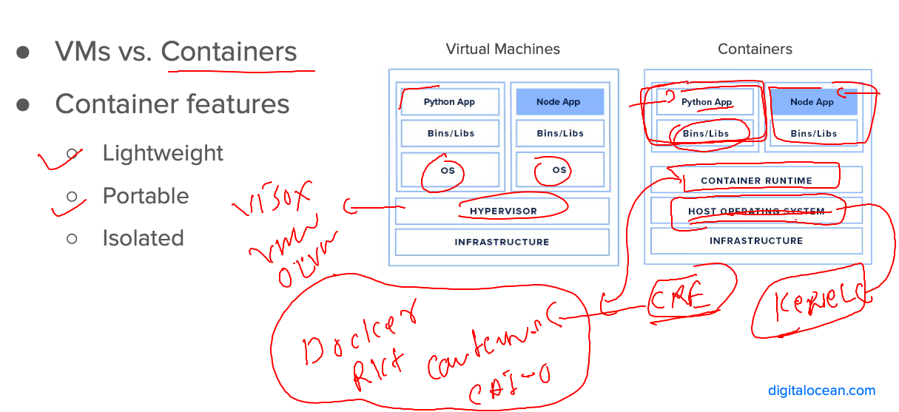
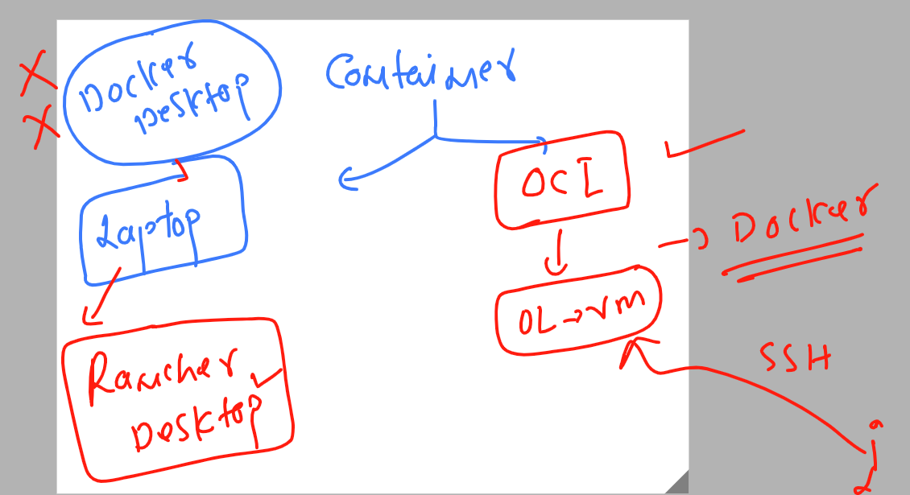
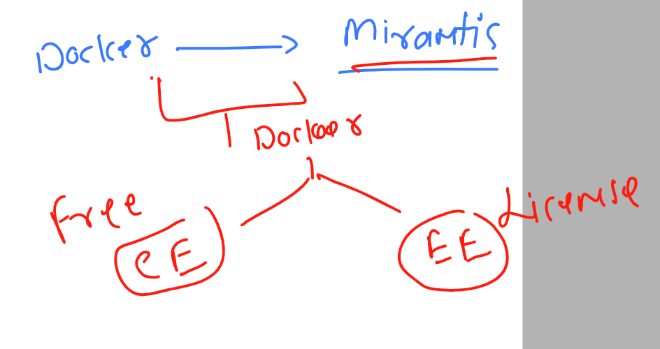
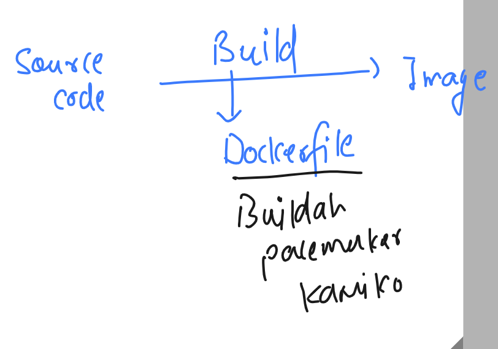
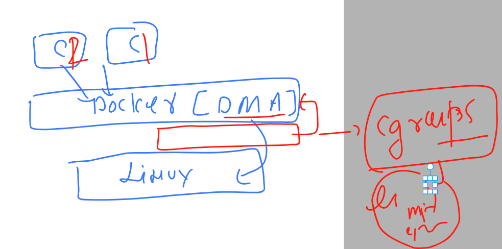

## Docker Revision -- freshing 

### Container vs vm 



### Isolation and resources limits in containers using Namesapce & contorl groups 


### labs -- 



### Installing docker in any LInux platform 

### checking linux kernel -- 3.10==>

```
[ec2-user@ip-172-31-31-88 ~]$ uname -r
6.1.21-1.45.amzn
```

### Docker ce vs docker ee



### Installing Docker ce on rhel|centos|oraclelinux|amazonlinux

```
[root@ip-172-31-31-88 ~]# yum install docker 
Last metadata expiration check: 0:03:23 ago on Mon Apr 17 04:43:55 2023.
Dependencies resolved.
==========================================================================================================================
 Package                            Architecture       Version                              Repository               Size
==========================================================================================================================
Installing:
 docker                             x86_64             20.10.17-1.amzn2023.0.6              amazonlinux              39 M
Installing dependencies:
 containerd                         x86_64             1.6.19-1.amzn2023.0.1                amazonlinux              31 M
 iptables-libs                      x86_64             1.8.8-3.amzn2023.0.2                 amazonlinux             401 k
 iptables-nft                       x
```

### starting docker engine service 

```
[root@ip-172-31-31-88 ~]# systemctl start  docker 
[root@ip-172-31-31-88 ~]# systemctl status  docker 
● docker.service - Docker Application Container Engine
     Loaded: loaded (/usr/lib/systemd/system/docker.service; disabled; preset: disabled)
     Active: active (running) since Mon 2023-04-17 04:59:01 UTC; 5s ago
TriggeredBy: ● docker.socket

```

### checking docker installation and conenct

```
[ashu@ip-172-31-31-88 ~]$ docker  version 
Client:
 Version:           20.10.17
 API version:       1.41
 Go version:        go1.19.3
 Git commit:        100c701
 Built:             Mon Mar 13 22:41:42 2023
 OS/Arch:           linux/amd64
 Context:           default
 Experimental:      true
Got permission denied while trying to connect to the Docker daemon socket at unix:///var/run/docker.sock: Get "http://%2Fvar%2Frun%2Fdocker.sock/v1.24/version": dial unix /var/run/docker.sock: connect: permission denied
[ashu@ip-172-31-31-88 ~]$ 


```

### adding ashu user in docker group

```
usermod -G  docker ashu 
[root@ip-172-31-31-88 ~]# 
[root@ip-172-31-31-88 ~]# grep docker  /etc/group
docker:x:992:ashu
[root@ip-172-31-31-88 ~]# 

```

### setting up image build environment 

```
[ashu@ip-172-31-31-88 ~]$ whoami
ashu
[ashu@ip-172-31-31-88 ~]$ docker  -v
Docker version 20.10.17, build 100c701
[ashu@ip-172-31-31-88 ~]$ ls
[ashu@ip-172-31-31-88 ~]$ mkdir ashu-images
[ashu@ip-172-31-31-88 ~]$ ls
ashu-images
[ashu@ip-172-31-31-88 ~]$ mkdir ashu-images/java
[ashu@ip-172-31-31-88 ~]$ mkdir ashu-images/python
[ashu@ip-172-31-31-88 ~]$ mkdir ashu-images/webapp
[ashu@ip-172-31-31-88 ~]$ ls
ashu-images
[ashu@ip-172-31-31-88 ~]$ ls  ashu-images/
java  python  webapp
[ashu@ip-172-31-31-88 ~]$ 

```

## Image building options 



### Dockefile for image building purpose 

### python code -- ashu.py 

```
import time

while True:
    print("Hello all , welcome to python..!!")
    time.sleep(3)
    print("Welcome to Oracle India ..")
    time.sleep(2)
    print("Welcome to Containers By Docker..!!")
    print("______________________")
    time.sleep(3)
```

### Dockerfile

```
FROM python 
# we are targetting python docker image from docker hub registry 
LABEL name=ashutoshh
LABEL email=ashutoshh@linux.com 
# OPtional field but you can use to share image developer details to user
RUN mkdir /mycode 
# inside existing python image i am creating a directory 
# RUN you are asking for shell access 
COPY ashu.py /mycode/
# copy is an instruction to copy code into /mycode/
CMD ["python","/mycode/ashu.py"]
# CMD is to define process (single process) 
# when you create container from this image it will start this process
```

### lets build image

```
[ashu@ip-172-31-31-88 ashu-images]$ ls
java  python  webapp
[ashu@ip-172-31-31-88 ashu-images]$ docker build  -t  ashupy:v1     python/ 
Sending build context to Docker daemon  3.584kB
Step 1/6 : FROM python
latest: Pulling from library/python
b0248cf3e63c: Pull complete 
127e97b4daf7: Pull complete 
0336c50c9f69: Pull complete 
```

### checking image 

```
[ashu@ip-172-31-31-88 ashu-images]$ docker images
REPOSITORY   TAG       IMAGE ID       CREATED              SIZE
tejsh        v1        c787061f0590   About a minute ago   921MB
hemapy       v1        280b1df192f4   About a minute ago   921MB
naveenpy     v1        5e976659fa2c   About a minute ago   921MB
ishanpy      v1        52a47ec4b348   2 minutes ago     
```

### creating containers 

```
[ashu@ip-172-31-31-88 ashu-images]$ docker  run  -it  -d  --name ashuc1  ashupy:v1  
a4b08906be729aee12521e61608b27fd48971b35397ae807e319aaa58b4524f2
[ashu@ip-172-31-31-88 ashu-images]$ docker  ps
CONTAINER ID   IMAGE       COMMAND                  CREATED         STATUS         PORTS     NAMES
a4b08906be72   ashupy:v1   "python /mycode/ashu…"   3 seconds ago   Up 2 seconds             ashuc1
```

### checking output 

```
ashu@ip-172-31-31-88 ashu-images]$ docker logs  ashuc1 
======>
Hello all , welcome to python..!!
Welcome to Oracle India ..
Welcome to Containers By Docker..!!

```

### getting access with container running shell

```
ashu@ip-172-31-31-88 ashu-images]$ docker  exec -it ashuc2  bash 
root@f147be1bd5f3:/# 
root@f147be1bd5f3:/# 
root@f147be1bd5f3:/# whoami
root
root@f147be1bd5f3:/# id
uid=0(root) gid=0(root) groups=0(root)
root@f147be1bd5f3:/# cd /mycode/
root@f147be1bd5f3:/mycode# ls
ashu.py
root@f147be1bd5f3:/mycode# exit
exit
```

### stop and remove containes  -- images

```
[ashu@ip-172-31-31-88 ashu-images]$ docker  kill ashuc1 ashuc2
ashuc2
Error response from daemon: Cannot kill container: ashuc1: Container a4b08906be729aee12521e61608b27fd48971b35397ae807e319aaa58b4524f2 is not running
[ashu@ip-172-31-31-88 ashu-images]$ docker  rm ashuc1 ashuc2 
ashuc1
ashuc2
[ashu@ip-172-31-31-88 ashu-images]$ 
[ashu@ip-172-31-31-88 ashu-images]$ docker rmi ashupy:v1 
Untagged: ashupy:v1
Deleted: sha256:e5279d701ffde12a5bbdaae8dc5136cf2f2c7defca8ad03a8df09df2e0114a20
Deleted: sha256:c9d953930d8a7884cb4704a000a625fa78ab25b32834a3cb38d4b9056ca02140
Deleted: sha256:6abdc4ede8bcdf2888fbc720e4bb6fc2095d2a99ca8a4139b1204ddba34beec4
[ashu@ip-172-31-31-88 ashu-images]$ docker rmi ashupy:v2 
Untagged: ashupy:v2
Deleted: sha256:b8334865f02538bd16a1ab701d34b99fd803fe215ed31d02af04716d1227b548
Deleted: sha256:042bc45d495ee88b704bbe6085221ad1f8fcd44ecb30db34d5f4e0dec76fb1f0
Deleted: sha256:055c6e021a81ec4445a56637986f8a7b934f11c4cc5cddd0bb03c435b51ee8ac
Deleted: sha256:d7d9325a018e181679f9bb0613b7afc03c71ba278af39429d0d1733fdc5f3279
Deleted: sha256:307a4c014ae5f2bbb9861f8dd5e191f880df1fa12de27be130807364a0cabd28
Deleted: sha256:77f1c8563ffc57ee580123d38c61f2051985c9787992746299acbb75420f2f48
[ashu@ip-172-31-31-88 ashu-images]$ 
```

### alpine docker python image 

```
FROM alpine 
LABEL name=ashutoshh
RUN apk add python3 && mkdir /code 
ADD https://raw.githubusercontent.com/redashu/pythonLang/main/while.py /code/
# copy vs add is add for copy data from URL 
RUN chmod 644  /code/while.py && adduser -D jack 
# adding jack user
USER jack 
# calling jack user 
ENTRYPOINT python3 /code/while.py 
# REplacement of CMD and also having few difference 

```

### building it 

```
[ashu@ip-172-31-31-88 ashu-images]$ ls
java  python  webapp
[ashu@ip-172-31-31-88 ashu-images]$ docker build -t  ashutask:v1 -f python/alpine.dockerfile  python/ 
Sending build context to Docker daemon  4.608kB
Step 1/7 : FROM alpine
 ---> 9ed4aefc74f6
Step 2/7 : LABEL name=ashutoshh
 ---> Running in 5f96acd97747
Removing intermediate container 5f96acd97747
 ---> 477a52813996
Step 3/7 : RUN apk add python3 && mkdir /code
 ---> Running in efaf9058aa43
fetch https://dl-cdn.alpinelinux.org/alpine/v3.17/main/x86_64/APKINDEX.tar.gz
fetch https://dl-cdn.alpinelinux.org/alpine/v3.17/community/x86_64/APKINDEX.tar.gz
(1/13) Installing libbz2 (1.0.8
```

### checking images 

```
[ashu@ip-172-31-31-88 ashu-images]$ docker images
REPOSITORY     TAG        IMAGE ID       CREATED              SIZE
ashutask       v1         24881dc3deab   About a minute ago   58.8MB
```

### creating contaienr 

```
[ashu@ip-172-31-31-88 ashu-images]$ docker run -itd --name ashucc2 ashutask:v1 
2b833d281943afc6b8eb9620e1242af65d334e859ea793913742835fb325635f
[ashu@ip-172-31-31-88 ashu-images]$ docker  ps
CONTAINER ID   IMAGE                  COMMAND                  CREATED          STATUS          PORTS     NAMES
2b833d281943   ashutask:v1            "/bin/sh -c 'python3…"   2 seconds ago    Up 1 second               ashucc2
57011795cc78   saivisalalp:pycodev1   "python3 /pycodes/sc…"   9 minutes ago    Up 9 minutes              saivisal_a1_c1
57b2ea720aa9   ishanalp:pycodev1      "python3 /pycodes/is…"   13 minutes ago   Up 13 minutes             ishanc1
e3176d982c81   tejsh:v3               "python /mycode/tejs…"   20 minutes ago   Up 20 minutes             tejsh
[ashu@ip-172-31-31-88 ashu-images]$ docker logs ashucc2
Hello all , welcome to python..!!
Welcome to LnB..
Welcome to Containers ..!!
______________________
```

### verify user

```
[ashu@ip-172-31-31-88 ashu-images]$ docker exec -it ashucc2 sh 
/ $ id
uid=1000(jack) gid=1000(jack) groups=1000(jack)
/ $ ps -e
PID   USER     TIME  COMMAND
    1 jack      0:00 python3 /code/while.py
    7 jack      0:00 sh
   14 jack      0:00 ps -e
/ $ exit
```
### Introduction to Control groups in Docker 




