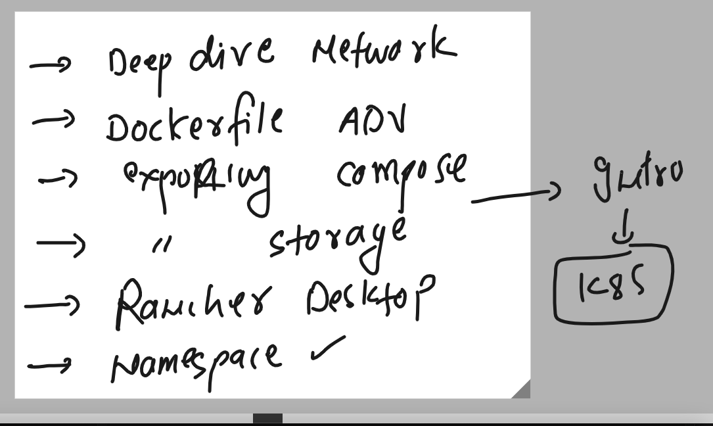
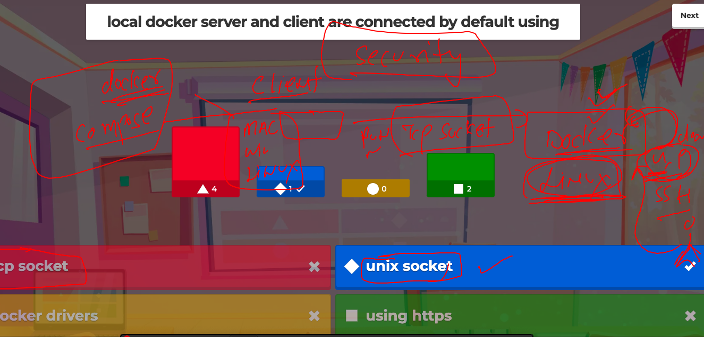
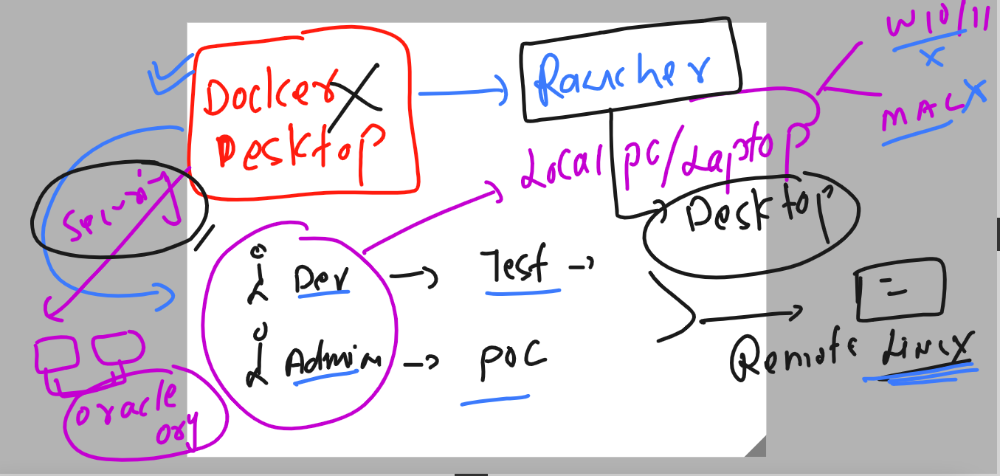
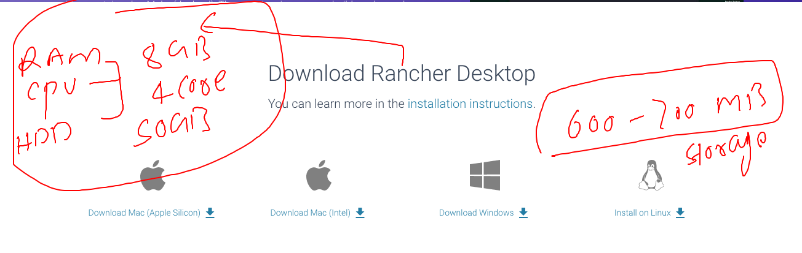
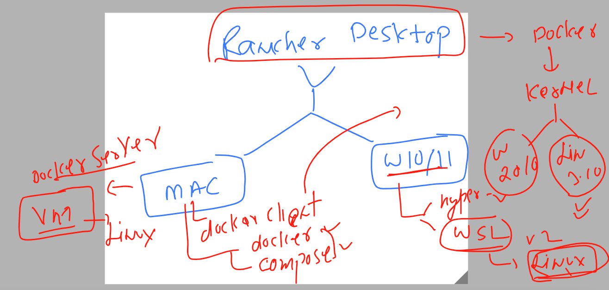
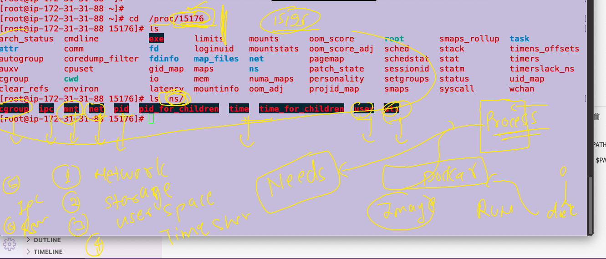
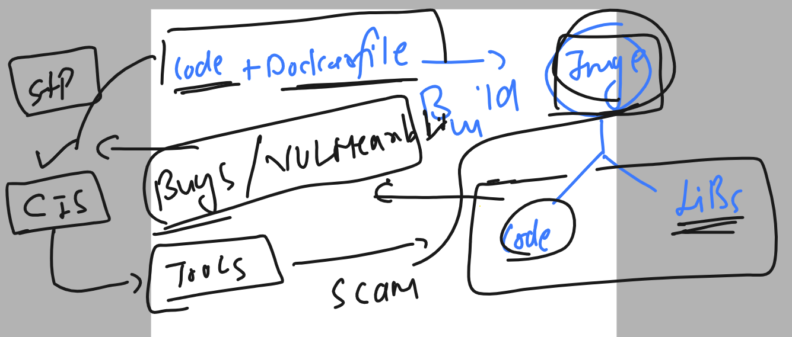
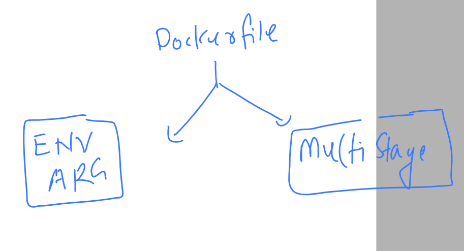
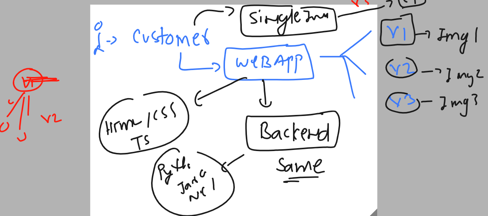
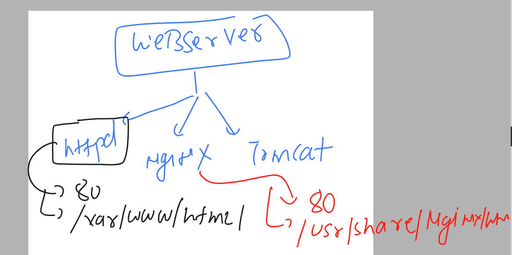

### target of the day 




### Revision 

### docker server store images in given format 

```
[root@ip-172-31-31-88 ~]# cd   /var/lib/docker
[root@ip-172-31-31-88 docker]# ls
buildkit  containers  image  network  overlay2  plugins  runtimes  swarm  tmp  trust  volumes
[root@ip-172-31-31-88 docker]# cd  image/
[root@ip-172-31-31-88 image]# ls
overlay2
[root@ip-172-31-31-88 image]# cd overlay2/
[root@ip-172-31-31-88 overlay2]# ls
distribution  imagedb  layerdb  repositories.json
[root@ip-172-31-31-88 overlay2]# cd imagedb/
[root@ip-172-31-31-88 imagedb]# ls
content  metadata
[root@ip-172-31-31-88 imagedb]# cd content/
[root@ip-172-31-31-88 content]# ls
sha256
[root@ip-172-31-31-88 content]# cd sha256/
[root@ip-172-31-31-88 sha256]# ls
014535df7ae3634d6aedf8e94be5f7abcc080a9588632caf4f3d10cbb852ef40
064991a0ba73a32b9170ce500a25c6f7bacff002b93f9ee496834d138382e91a
06a36ca3206d695b904f50009e43f226fc8efc20a9a8d6245d8e625999ea9f81
08b096c935ed67159802a8d849af7d2c5eda19408ca0931
```

### replacing entrypoint based parent process 

```
docker run -it --name c1 --entrypoint  sleep 100   alpine
```

### Docker client & server model



### Creating custom bridge with subnet 

```
root@ip-172-31-31-88 ~]# docker network create br3  --subnet  192.169.100.0/24 
7db7cfdff8221a84bdff71c56e93e5632eb3e766cdaac0e650a9169ff1a34d9f
```

### giving static ip to container 

```
[root@ip-172-31-31-88 ~]# docker run -itd --name c9  --network br3  alpine 
c622bef8e15e9ef36a80ab0f4b31bc6f3c1f9f3c617c5532c23d4ee9a9cde3f0
[root@ip-172-31-31-88 ~]# docker exec -it c9 ifconfig 
eth0      Link encap:Ethernet  HWaddr 02:42:C0:A9:64:02  
          inet addr:192.169.100.2  Bcast:192.169.100.255  Mask:255.255.255.0
          UP BROADCAST RUNNING MULTICAST  MTU:1500  Metric:1
          RX packets:12 errors:0 dropped:0 overruns:0 frame:0
          TX packets:0 errors:0 dropped:0 overruns:0 carrier:0
          collisions:0 txqueuelen:0 
          RX bytes:1112 (1.0 KiB)  TX bytes:0 (0.0 B)


```

## Introduction to Rancher Desktop 



### rancher desktop prerequisite 



### Rancher Desktop reality 



## Container Security context 

### giving security by blocking root user 

```
[ashu@ip-172-31-31-88 ashu-images]$ cd python/
[ashu@ip-172-31-31-88 python]$ ls
Dockerfile  alpine.dockerfile  ashu.py
[ashu@ip-172-31-31-88 python]$ docker build -t  ashupy:v2 -f alpine.dockerfile  . 
Sending build context to Docker daemon  4.608kB
Step 1/8 : FROM alpine
latest: Pulling from library/alpine
f56be85fc22e: Pull complete 
Digest: sha256:124c7d2707904eea7431fffe91522a01e5a861a624ee31d03372cc1d138a3126
Status: Downloaded newer image for alpine:latest
 ---> 9ed4aefc74f6
Step 2/8 : LABEL name=ashutoshh
 ---> Running in 5efd6b191adc
Removing intermediate container 5efd6b191adc
 ---> 379adfa3cd8c
Step 3/8 : RUN apk add python3 && mkdir /code
 ---> Running in 998bf8a449b1
fetch https://dl-cdn.alpinelinux.org/alpine/v3.17/main/x86_64/APKINDEX.tar.gz
fetch https://dl-cdn.alpinelinux.org/alpine/v3.17/community/x86_64/APKINDEX.tar.gz
(1/13) Installing libbz2 (1.0.8-r4)
(2/13) Installing libexpat (2.5.0-r0)
(3/13) Installing libffi (3.4.4-r0)
(4/13) Installing gdbm (1.23-r0)
(5/13) Installing xz-libs (5.2.9-r0)
(6/13) Installing libgcc (12.2.1_git20220924-r4)
(7/13) Installing libstdc++ (12.2.1_git20220924-r4)
(8/13) Installing mpdecimal (2.5.1-r1)
(9/13) Installing ncurses-terminfo-base (6.3_p20221119-r0)
(10/13) Installing ncurses-libs (6.3_p20221119-r0)
(11/13) Installing readline (8.2.0-r0)
(12/13) Installing sqlite-libs (3.40.1-r0)
(13/13) Installing python3 (3.10.11-r0)
Executing busybox-1.35.0-r29.trigger
OK: 60 MiB in 28 packages
Removing intermediate container 998bf8a449b1
 ---> d75a2a7b0fed
Step 4/8 : ADD https://raw.githubusercontent.com/redashu/pythonLang/main/while.py /code/
Downloading     232B
[ashu@ip-172-31-31-88 python]$ 
[ashu@ip-172-31-31-88 python]$ 
[ashu@ip-172-31-31-88 python]$ 
[ashu@ip-172-31-31-88 python]$ docker images
REPOSITORY   TAG       IMAGE ID       CREATED          SIZE
ashupy       v2        2c0d4a94a495   22 seconds ago   58.8MB
alpine       latest    9ed4aefc74f6   2 weeks ago      7.05MB
[ashu@ip-172-31-31-88 python]$ docker run -itd --name c1 ashupy:v2 
97d14b3ad7cb44b9436bcb55b0d15d4b22dec7152e57de8dde5dad3697c884d1
[ashu@ip-172-31-31-88 python]$ docker ps
CONTAINER ID   IMAGE       COMMAND                  CREATED         STATUS        PORTS     NAMES
97d14b3ad7cb   ashupy:v2   "python3 /code/while…"   2 seconds ago   Up 1 second             c1
[ashu@ip-172-31-31-88 python]$ docker logs c1
Hello all , welcome to python..!!
Welcome to LnB..
Welcome to Containers ..!!
______________________
Hello all , welcome to python..!!
Welcome to LnB..
Welcome to Containers ..!!
______________________
[ashu@ip-172-31-31-88 python]$ docker logs c1 -f
Hello all , welcome to python..!!
Welcome to LnB..
Welcome to Containers ..!!
______________________
Hello all , welcome to python..!!
Welcome to LnB..
Welcome to Containers ..!!
______________________
Hello all , welcome to python..!!
Welcome to LnB..
Welcome to Containers ..!!
______________________
Hello all , welcome to python..!!
^C
```

### security container by remove shell from container image

```
FROM alpine 
LABEL name=ashutoshh
RUN apk add python3 && mkdir /code 
ADD https://raw.githubusercontent.com/redashu/pythonLang/main/while.py /code/
# copy vs add is add for copy data from URL 
RUN chmod 644  /code/while.py && adduser -D jack 
RUN rm -rf /bin/sh 
# adding jack user
USER jack 
# calling jack user 
ENTRYPOINT ["python3"] 
CMD ["/code/while.py"] 
# REplacement of CMD and also having few difference 
# as last argument it is not replacable 

```

### check 

```
230  docker run -itd --name c2 ashupy:v3 
  231  docker ps
  232  docker logs -f c2
  
[ashu@ip-172-31-31-88 python]$ docker  exec -it c2 sh
OCI runtime exec failed: exec failed: unable to start container process: exec: "sh": executable file not found in $PATH: unknown
[ashu@ip-172-31-31-88 python]$ 
```

### demo 

```
  48  nsenter -t  15176  --uts --mount   bash 
   49  nsenter -t  15176  --uts --mount  sh 
   50  nsenter -t  15176  --uts --mount ip a
   51  nsenter -t  15176  --uts --mount ifconfig 
   52  nsenter -t  15176  --uts --mount whoami
   53  nsenter -t  15176  --uts --mount mkdir  /okkk
   54  nsenter -t  15176  --uts --mount ls /
   55  nsenter -t  15176  --uts --mount  ls  /code
   56  nsenter -t  15176  --net  ifconfig 
   57  nsenter -t  15176  --net --uts --mount   ifconfig 
   58  nsenter -t  15176  --net --uts --mount   ip a
   59  nsenter -t  15176   --uts --mount   ip a
   60  nsenter -t  15176   --uts --mount   ifconfig 
   61  nsenter -t  15176   --net   ifconfig 
   62  history 
[root@ip-172-31-31-88 ~]# ps -e  | grep python 
  15176 ?        00:00:00 python3
  19152 ?        00:00:00 python3
```

### namespace drama




## Understanding CIS std for container image / code security bugs finding purpose 



### installing and using trivy 

```
[root@ip-172-31-31-88 ~]# rpm -ivh https://github.com/aquasecurity/trivy/releases/download/v0.40.0/trivy_0.40.0_Linux-64bit.rpm
Retrieving https://github.com/aquasecurity/trivy/releases/download/v0.40.0/trivy_0.40.0_Linux-64bit.rpm
warning: /var/tmp/rpm-tmp.o9udur: Header V4 RSA/SHA256 Signature, key ID 6276fa6c: NOKEY
Verifying...                          ################################# [100%]
Preparing...                          ################################# [100%]
Updating / installing...
   1:trivy-0:0.40.0-1                 ################################# [100%]
[root@ip-172-31-31-88 ~]# 
[root@ip-172-31-31-88 ~]# 
[root@ip-172-31-31-88 ~]# trivy version 
Version: 0.40.0
[root@ip-172-31-31-88 ~]#
```

### lets do this

```
 254  trivy image alpine
  255  trivy image ashupy:v2 
  256  trivy image  nginx:1.12 
```

## task 

### Directory 

```
[ashu@ip-172-31-31-88 ashu-task]$ pwd
/home/ashu/ashu-images/ashu-task
```

### java code -- ashu.java

```
class myclass { 
    public static void main(String args[]) 
    { 
        // test expression 
        while (true) { 
            System.out.println("Hello World By Ashutoshh !! "); 
            try {
                Thread.sleep(2000);
            } catch (Exception ex) {
                // Ignored
            }
  
            // update expression 
        } 
    } 
} 
```

### dockerfile -- java8.dockerfile

```
FROM oraclelinux:8.4 
LABEL name=ashutoshh
LABEL   email=ashutoshh@linux.com
RUN dnf install java-1.8.0-openjdk.x86_64 java-1.8.0-openjdk-devel.x86_64 -y 
RUN mkdir /code 
COPY ashu.java /code/
WORKDIR /code
# changing directory like cd command 
RUN javac ashu.java 
# compiling 
CMD ["java","myclass"]
```

### docker-compose file 

```
version: '3.8'
# 3.x is already creating a new docker bridge
networks: # creating bridge with custom name
  ashubr11: 
services: 
  ashu-java-test:
    image: ashujava:v1 
    build:
      context: . 
      dockerfile: java8.dockerfile
    container_name: ashujc1 
    networks: # attaching container to the custom bridge 
    - ashubr11 
```

### lets run it 

```
[ashu@ip-172-31-31-88 ashu-task]$ ls
ashu.java  docker-compose.yaml  java8.dockerfile
[ashu@ip-172-31-31-88 ashu-task]$ docker-compose  up -d --build 
[+] Building 62.0s (11/11) FINISHED                                                                                             
 => [internal] load build definition from java8.dockerfile                                                                 0.0s
 => => transferring dockerfile: 406B                                                                                       0.0s
 => [internal] load .dockerignore                                                                                          0.0s
 => => transferring context: 2B                                                                                            0.0s
 => [internal] load metadata for docker.io/library/oraclelinux:8.4                                                         0.0s
 => [internal] load build context                                                                                          0.0s
 => => transferring context: 471B                                                                                          0.0s
 => CACHED [1/6] FROM docker.io/library/oraclelinux:8.4                                                                    0.0s
 => [2/6] RUN dnf install java-1.8.0-openjdk.x86_64 java-1.8.0-openjdk-devel.x86_64 -y                                    55.9s
 => [3/6] RUN mkdir /code                                                                                                  0.5s
 => [4/6] COPY ashu.java /code/                                                                                            0.1s 
 => [5/6] WORKDIR /code                                                                                                    0.1s 
 => [6/6] RUN javac ashu.java                                                                                              1.4s 
 => exporting to image                                                                                                     3.8s 
 => => exporting layers                                                                                                    3.8s 
 => => writing image sha256:c0a687f65489c32a93be2c517f266decd53b3b54e75f3776b097f11c59163e24                               0.0s
 => => naming to docker.io/library/ashujava:v1                                                                             0.0s
[+] Running 2/2
 ✔ Network ashu-task_ashubr11  Created                                                                                     0.1s 
 ✔ Container ashujc1           Started                         
```

### checking 

```
[ashu@ip-172-31-31-88 ashu-task]$ docker-compose  ps
NAME                IMAGE               COMMAND             SERVICE             CREATED             STATUS              PORTS
ashujc1             ashujava:v1         "java myclass"      ashu-java-test      7 seconds ago       Up 6 seconds   
```

### output 

```
[ashu@ip-172-31-31-88 ashu-task]$ docker-compose  logs ashu-java-test
ashujc1  | Hello World By Ashutoshh !! 
ashujc1  | Hello World By Ashutoshh !! 
ashujc1  | Hello World By Ashutoshh !! 
ashujc1  | Hello World By Ashutoshh !! 
```

### scaning of image 

```
[ashu@ip-172-31-31-88 ashu-task]$ trivy   image  ashujava:v1 
2023-04-18T07:30:30.653Z        INFO    Vulnerability scanning is enabled
2023-04-18T07:30:30.653Z        INFO    Secret scanning is enabled
2023-04-18T07:30:30.653Z        INFO    If your scanning is slow, please try '--scanners vuln' to disable secret scanning
2023-04-18T07:30:30.653Z        INFO    Pleas
```

### more options 

```
ashu@ip-172-31-31-88 ashu-task]$ trivy   image  --severity HIGH,CRITICAL  ashujava:v1   
2023-04-18T07:32:15.067Z        INFO    Vulnerability scanning is enabled
2023-04-18T07:32:15.067Z        INFO    Secret scanning is enabled
2023-04-18T07:32:15.067Z        INFO    If your scanning is slow, please try '--scanners vuln' to disable secret scanning
2023-04-18T07:32:15.067Z        INFO    Please see also https://aquasecurity.github.io/trivy/v0.40/docs/secret/scanning/#recommendation for faster secret detection
2023-04-18T07:32:15.082Z        INFO    Detected OS: oracle
2023-04-18T07:32:15.082Z        INFO    Detecting Oracle Linux vulnerabilities...
2023-04-18T07:32:15.095Z        INFO    Number of language-specific files: 0

ashujava:v1 (oracle 8.4)

Total: 30 (HIGH: 30, CRITICAL: 0)

┌──────────────────┬────────────────┬──────────┬────────────────────────┬───────────────────────┬──────────────────────────────────────────────────────────────┐
│     Library      │ Vulnerability  │ Severity │   Installed Version    │     Fixed Version     │                            Title                             │
├──────────────────┼────────────────┼──────────┼────────────────────────┼───────────────────────┼──────────────────────────────────────────────────────────────┤
│ bind-export-libs │ CVE-2022-38177 │ HIGH     │ 32:9.11.26-4.el8_4     │ 32:9.11.36-3.el8_6.1  │ bind: memory leak in ECDSA DNSSEC verification code          │
│                  │                │          │                        │                       │ https://avd.aquasec.com/nvd/cve-2022-38177                   │
│                  ├────────────────┤          │                        │                       ├──────────────────────────────────────────────────────────────┤
│                  │ CVE-2022-38178 │          │                        │                       │ bind: memory leaks in EdDSA DNSSEC verification code         │
│                  │                │          │                        │                       │ https://avd.aquasec.com/nvd/cve-2022-38178                   │
├──────────────────┼────────────────┤          ├────────────────────────┼───────────────────────┼──────────────────────────────────────────────────────────────┤
│ cyrus-sasl-lib   │ CVE-2022-24407 │          │ 2.1.27-5.el8           │ 2.1.27-6.el8_5        │ cyrus-sasl: failure to properly escape SQL input allows an   │
│                  │                │          │                        │                       │ attacker to execute...                                       │
│                  │                │          │                        │                       │ https://avd.aquasec.com/nvd/cve-2022-24407                   │
├──────────────────┼────────────────┤          ├────────────────────────┼───────────────────────┼──────────────────────────────────────────────────────────────┤
│ expat            │ CVE-2021-45960 │          │ 2.2.5-4.el8            │ 2.2.5-4.el8_5.3       │ expat: Large number of prefixed XML attributes on a single   │
│                  │                │          │                        │                       │ tag can...                                                   │
│                  │                │          │                        │                       │ https://avd.aquasec.com/nvd/cve-2021-45960                   │
│                  ├────────────────┤          │                        │                       ├──────────────────────────────────────────────────────────────┤
│                  │ CVE-2021-46143 │          │                        │                       │ expat: Integer overflow in doProlog in xmlparse.c            │
│                  │                │          │                        │                       │ https://avd.aquasec.com/nvd/cve-2021-46143                   │
│                  ├────────────────┤          │                        │                       ├──────────────────────────────────────────────────────────────┤
│                  │ CVE-2022-23852 │          │                        │                       │ expat: Integer overflow in function XML_GetBuffer            │
│                  │                │          │                        │                       │ https://avd.aquasec.com/nvd/cve-2022-23852                   │
│                  ├────────────────┤          │                        ├───────────────────────┼──────────────────────────────────────────────────────────────┤
│                  │ CVE-2022-23990 │          │                        │ 2.2.5-4.0.1.el8_5.3   │ expat: integer overflow in the doProlog function             │
│                  │                │          │                        │                       │ https://avd.aquasec.com/nvd/cve-2022-23990                   │
│                  ├────────────────┤          │                        ├───────────────────────┼──────────────────────────────────────────────────────────────┤
│                  │ CVE-2022-25235 │          │                        │ 2.2.5-4.el8_5.3       │ expat: Malformed 2- and 3-byte UTF-8 sequences can lead to   │
│                  │                │          │                        │                       │ arbitrary code...                                            │
│                  │                │          │                        │                       │ https://avd.aquasec.com/nvd/cve-2022-25235                   │
│                  ├────────────────┤          │                        │                       ├──────────────────────────────────────────────────────────────┤
│                  │ CVE-2022-25236 │          │                        │                       │ expat: Namespace-separator characters in "xmlns[:prefix]"    │
│                  │                │          │                        │                       │ attribute values can lead to arbitrary code...               │
│                  │                │          │                        │                       │ https://avd.aquasec.com/nvd/cve-2022-25236                   │
│                  ├────────────────┤          │                        │                       ├──────────────────────────────────────────────────────────────┤
│                  │ CVE-2022-25315 │          │                        │                       │ expat: Integer overflow in storeRawNames()                   │
│                  │                │          │                        │                       │ https://avd.aquasec.com/nvd/cve-2022-25315                   │
│                  ├────────────────┤          │                        ├───────────────────────┼──────────────────────────────────────────────────────────────┤
│                  │ CVE-2022-40674 │          │                        │ 2.2.5-8.0.1.el8_6.3   │ expat: a use-after-free in the doContent function in         │
│                  │                │          │                        │                       │ xmlparse.c                                                   │
│                  │                │          │                        │                       │ https://avd.aquasec.com/nvd/cve-2022-40674                   │
├──────────────────┼────────────────┤          ├────────────────────────┼───────────────────────┼──────────────────────────────────────────────────────────────┤
│ gzip             │ CVE-2022-1271  │          │ 1.9-12.el8             │ 1.9-13.el8_5          │ gzip: arbitrary-file-write vulnerability                     │
│                  │                │          │                        │                       │ https://avd.aquasec.com/nvd/cve-2022-1271                    │
├──────────────────┼────────────────┤          ├────────────────────────┼───────────────────────┼──────────────────────────────────────────────────────────────┤
│ krb5-libs        │ CVE-2022-42898 │          │ 1.18.2-8.3.el8_4       │ 1.18.2-22.0.1.el8_7   │ krb5: integer overflow vulnerabilities in PAC parsing        │
│                  │                │          │                        │                       │ https://avd.aquasec.com/nvd/cve-2022-42898                   │
├──────────────────┼────────────────┤          ├────────────────────────┼───────────────────────┼──────────────────────────────────────────────────────────────┤
│ libgcrypt        │ CVE-2021-40528 │          │ 1.8.5-4.el8            │ 10:1.8.5-7.el8_6_fips │ libgcrypt: ElGamal implementation allows plaintext recovery  │
│                  │                │          │                        │                       │ https://avd.aquasec.com/nvd/cve-2021-40528                   │
├──────────────────┼────────────────┤          ├────────────────────────┼───────────────────────┼──────────────────────────────────────────────────────────────┤
│ libksba          │ CVE-2022-3515  │          │ 1.3.5-7.el8            │ 1.3.5-8.el8_6         │ libksba: integer overflow may lead to remote code execution  │
│                  │                │          │                        │                       │ https://avd.aquasec.com/nvd/cve-2022-3515                    │
│                  ├────────────────┤          │                        ├───────────────────────┼──────────────────────────────────────────────────────────────┤
│                  │ CVE-2022-47629 │          │                        │ 1.3.5-9.el8_7         │ libksba: integer overflow to code execution                  │
│                  │                │          │                        │                       │ https://avd.aquasec.com/nvd/cve-2022-47629                   │
├──────────────────┼────────────────┤          ├────────────────────────┼───────────────────────┼──────────────────────────────────────────────────────────────┤
│ openssl-libs     │ CVE-2022-4304  │          │ 1:1.1.1g-15.el8_3      │ 1:1.1.1k-9.el8_7      │ timing attack in RSA Decryption implementation               │
│                  │                │          │                        │         
```


### TIp for search jdk in oraclelinux:8.4 

```
[ashu@ip-172-31-31-88 ashu-task]$ docker run -it --rm oraclelinux:8.4 
[root@7e58f9c97fb5 /]# 
[root@7e58f9c97fb5 /]# 
[root@7e58f9c97fb5 /]# dnf search jdk 
Oracle Linux 8 BaseOS Latest (x86_64)                                                            72 MB/s |  57 MB     00:00    
Oracle Linux 8 Application Stream (x86_64)                                                       64 MB/s |  43 MB     00:00    
Last metadata expiration check: 0:00:11 ago on Tue Apr 18 07:38:11 2023.
================================================= Name & Summary Matched: jdk ==================================================
copy-jdk-configs.noarch : JDKs configuration files copier
copy-jdk-configs.src : JDKs configuration files copier
java-1.8.0-openjdk.src : OpenJDK 8 Runtime Environment
java-1.8.0-openjdk.x86_64 : OpenJDK 8 Runtime Environment
java-1.8.0-openjdk-accessibility.x86_64 : OpenJDK 8 accessibility connector
java-1.8.0-openjdk-demo.x86_64 : OpenJDK 8 Demos
java-1.8.0-openjdk-devel.x86_64 : OpenJDK 8 Development Environment
```

### Dockerfile advanced concept 



### custom story of webapp



### cloning sample apps

```
[ashu@ip-172-31-31-88 ashu-images]$ cd ashu-customer/
[ashu@ip-172-31-31-88 ashu-customer]$ ls
[ashu@ip-172-31-31-88 ashu-customer]$ git clone https://github.com/schoolofdevops/html-sample-app.git
Cloning into 'html-sample-app'...

 git clone https://github.com/microsoft/project-html-website.git
 
 ===
 [ashu@ip-172-31-31-88 ashu-customer]$ ls
html-sample-app  project-html-website
```

### using webserver to hosting app in containers



### Dockerfile -- using ENV 

```
FROM oraclelinux:8.4 
LABEL name=ashutoshh
ENV deploy=app 
# to create env variable and its default value 
RUN yum install httpd -y 
RUN mkdir /webapp  /webapp/app1 /webapp/app2 
COPY html-sample-app /webapp/app1/
COPY project-html-website /webapp/app2/
COPY deploy_app.sh  /webapp/
WORKDIR /webapp
RUN chmod +x deploy_app.sh 
ENTRYPOINT ["./deploy_app.sh"]
```

### adding compose file 

```
version: '3.8'
services:
  ashu-customer-case:
    image: ashu-customer:app
    build:
      context: .
      dockerfile: Dockerfile 
    container_name: ashu-c1
    environment: # passing env variable and value 
      deploy: "world"
    ports: # for forwarding 
    - 1234:80 
```

### running compose 

```
[ashu@ip-172-31-31-88 ashu-customer]$ ls
Dockerfile  deploy_app.sh  docker-compose.yaml  html-sample-app  project-html-website
[ashu@ip-172-31-31-88 ashu-customer]$ docker-compose  up -d --build 
[+] Building 65.6s (13/13) FINISHED                                                                                             
 => [internal] load build definition from Dockerfile                                                                       0.0s
 => => transferring dockerfile: 455B                                                                                       0.0s
 => [internal] load .dockerignore                                                                                          0.0s
 => => transferring context: 224B                                                                                          0.0s
 => [internal] load metadata for docker.io/library/oraclelinux:8.4                                                         0.0s
 => [internal] load build context                                                                                          0.1s
 => => transferring context: 2.88MB                                                                                        0.1s
 => CACHED [1/8] FROM docker.io/library/oraclelinux:8.4                                                                    0.0s
 => [2/8] RUN yum install httpd -y                                                                                        57.2s
 => [3/8] RUN mkdir /webapp  /webapp/app1 /webapp/app2                                                                     1.3s
 => [4/8] COPY html-sample-app /webapp/app1/                                                                               0.2s 
 => [5/8] COPY project-html-website /webapp/app2/                                                                          0.3s 
 => [6/8] COPY deploy_app.sh  /webapp/                                                                                     0.2s 
 => [7/8] WORKDIR /webapp                                                                                                  0.2s 
 => [8/8] RUN chmod +x deploy_app.sh                                                                                       1.6s 
 => exporting to image                                                                                                     4.3s
 => => exporting layers                                                                                                    4.2s
 => => writing image sha256:badcc953322f7a2b92efba0cc9858df7a758acc87d71e8c554b963b308b6f5ac                               0.0s
 => => naming to docker.io/library/ashu-customer:app                                                                       0.0s
[+] Running 2/2
 ✔ Network ashu-customer_default  Created                                                                                  0.4s 
 ✔ Container ashu-c1              Started               
```

### checking

```
[ashu@ip-172-31-31-88 ashu-customer]$ docker-compose  ps
NAME                IMAGE               COMMAND             SERVICE              CREATED             STATUS              PORTS
ashu-c1             ashu-customer:app   "./deploy_app.sh"   ashu-customer-case   34 seconds ago      Up 32 seconds       0.0.0.0:1234->80/tcp, :::1234->80/tcp
[ashu@ip-172-31-31-88 ashu-customer]$ 
```

### containers with compose 

```
version: '3.8'
services:
  ashu-customer-case:
    image: ashu-customer:app
    build:
      context: .
      dockerfile: Dockerfile 
    container_name: ashu-c1
    environment: # passing env variable and value 
      deploy: "world"
    ports: # for forwarding 
    - 1234:80 
  ashu-customer-case2:
    image: ashu-customer:app
    container_name: ashu-c2
    environment:
      deploy: "hello"
    ports:
      - 1255:80 
      
```


