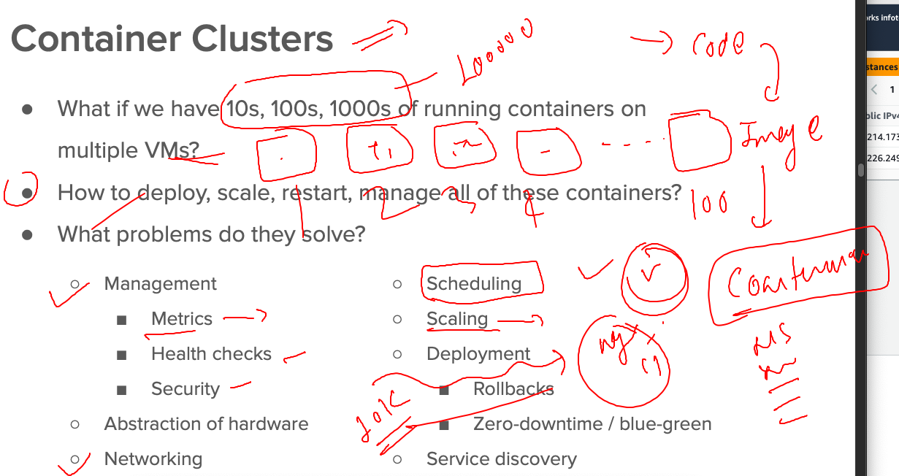

##

### Introduction of podman 


### Installing podman

```
[root@ip-172-31-93-201 ~]# dnf install podman 
Updating Subscription Management repositories.
Unable to read consumer identity

This system is not registered with an entitlement server. You can use subscription-manager to register.

Red Hat Enterprise Linux 9 for x86_64 - AppStream from RHUI (RPMs)                               20 MB/s |  18 MB     00:00    
Red Hat Enterprise Linux 9 for x86_64 - BaseOS from RHUI (RPMs)                                  17 MB/s |  10 MB     00:00    
Red Hat Enterprise Linux 9 Client Configuration                                                  23 kB/s | 2.8 kB     00:00    
Last metadata expiration check: 0:00:01 ago on Wed 19 Apr 2023 04:42:22 AM UTC.
Dependencies resolved.
================================================================================================================================
 Package                        Architecture       Version                         Repository                              Size
================================================================================================================================
Installing:
 podman                         x86_64             2:4.2.0-11.el9_1                rhel-9-appstream-rhui-rpms              12 M
Installing dependencies:
 conmon                         x86_64             2:2.1.4-1.el9                   rhel-9-appstream-rhui-rpms              55 k
 container-selinux              noarch             3:2.189.0-1.el9                 rhel-9-appstream-rhui-rpms              53 k
 containers-common              x86_64             2:1-49.el9_1                    rhel-9-appstream-rhui-rpms             121 k
 criu                           x86_64       
```

### configuration directory 

```
[root@ip-172-31-93-201 ~]# cd /etc/containers/
[root@ip-172-31-93-201 containers]# ls
certs.d  oci  policy.json  registries.conf  registries.conf.d  registries.d  storage.conf
[root@ip-172-31-93-201 containers]# 


```

### No service start required 

```
[root@ip-172-31-93-201 containers]# podman images
REPOSITORY  TAG         IMAGE ID    CREATED     SIZE
[root@ip-172-31-93-201 containers]# podman ps
CONTAINER ID  IMAGE       COMMAND     CREATED     STATUS      PORTS       NAMES
[root@ip-172-31-93-201 containers]# podman 

```

### giving podman access to a non root user 

```
[root@ip-172-31-93-201 ~]# useradd  oracle 
[root@ip-172-31-93-201 ~]# 
[root@ip-172-31-93-201 ~]# 
[root@ip-172-31-93-201 ~]# su - oracle
[oracle@ip-172-31-93-201 ~]$ 
[oracle@ip-172-31-93-201 ~]$ 
[oracle@ip-172-31-93-201 ~]$ id
uid=1001(oracle) gid=1001(oracle) groups=1001(oracle) context=unconfined_u:unconfined_r:unconfined_t:s0-s0:c0.c1023
[oracle@ip-172-31-93-201 ~]$ 
[oracle@ip-172-31-93-201 ~]$ podman images
WARN[0000] The cgroupv2 manager is set to systemd but there is no systemd user session available 
WARN[0000] For using systemd, you may need to login using an user session 
WARN[0000] Alternatively, you can enable lingering with: `loginctl enable-linger 1001` (possibly as root) 
WARN[0000] Falling back to --cgroup-manager=cgroupfs    
REPOSITORY  TAG         IMAGE ID    CREATED     SIZE
WARN[0000] Failed to add pause process to systemd sandbox cgroup: exec: "dbus-launch": executable file not found in $PATH 
[oracle@ip-172-31-93-201 ~]$ 
logout
[root@ip-172-31-93-201 ~]# loginctl enable-linger 1001
[root@ip-172-31-93-201 ~]# su - oracle
Last login: Wed Apr 19 04:44:35 UTC 2023 on pts/0
[oracle@ip-172-31-93-201 ~]$ podman images
REPOSITORY  TAG         IMAGE ID    CREATED     SIZE
[oracle@ip-172-31-93-201 ~]$ 


```


### podman can do auto search in multiple registry

```
[root@ip-172-31-93-201 ~]# cd  /etc/containers/
[root@ip-172-31-93-201 containers]# ls
certs.d  networks  oci  policy.json  registries.conf  registries.conf.d  registries.d  storage.conf
[root@ip-172-31-93-201 containers]# vim registries.conf
-bash: vim: command not found
[root@ip-172-31-93-201 containers]# dnf install vim -y &>/dev/null 
[root@ip-172-31-93-201 containers]# 
[root@ip-172-31-93-201 containers]# vim registries.conf
[root@ip-172-31-93-201 containers]# vim registries.conf
[root@ip-172-31-93-201 containers]# grep -in unqualified  registries.conf
3:# NOTE: RISK OF USING UNQUALIFIED IMAGE NAMES
20:# # An array of host[:port] registries to try when pulling an unqualified image, in order.
22:unqualified-search-registries = ["registry.access.redhat.com", "registry.redhat.io", "docker.io"]
[root@ip-172-31-93-201 containers]# 


```

### pulling images 

```
[root@ip-172-31-93-201 ~]# podman  pull dockerashu/ashucimg:v007
✔ docker.io/dockerashu/ashucimg:v007
Trying to pull docker.io/dockerashu/ashucimg:v007...
Getting image source signatures
Copying blob 7a015defac78 done  
Copying blob 7a015defac78 done  
Copying blob a4df6f21af84 done  
Copying config d4d0377464 done  
Writing manifest to image destination
Storing signatures
d4d0377464d5a4ab31307880f8d371c2101b45fcef31cb723a01b76b74e080aa
[root@ip-172-31-93-201 ~]# 
[root@ip-172-31-93-201 ~]# podman images
REPOSITORY                       TAG         IMAGE ID      CREATED       SIZE
docker.io/dockerashu/ashucimg    v007        d4d0377464d5  18 hours ago  537 MB
docker.io/library/alpine         latest      9ed4aefc74f6  2 weeks ago   7.34 MB
registry.access.redhat.com/ubi8  latest      768688a18971  3 weeks ago   214 MB
[root@ip-172-31-93-201 ~]# 
[root@ip-172-31-93-201 ~]# 
[root@ip-172-31-93-201 ~]# su - oracle
Last login: Wed Apr 19 04:45:27 UTC 2023 on pts/0
[oracle@ip-172-31-93-201 ~]$ 
[oracle@ip-172-31-93-201 ~]$ 
[oracle@ip-172-31-93-201 ~]$ podman images
REPOSITORY  TAG         IMAGE ID    CREATED     SIZE
[oracle@ip-172-31-93-201 ~]$ 


```

### problem with container scale in prod 



## Introduction to container orchestration 


## Introduction k8s 


### ways to setup k8s cluster 


### Now are having 3 vm 

## step to setup ks8 cluster 

### Step to perform in every vm 

```
modprobe br_netfilter
echo '1' > /proc/sys/net/bridge/bridge-nf-call-iptables

swapoff  -a

cat  <<EOF  >/etc/yum.repos.d/kube.repo
[kube]
baseurl=https://packages.cloud.google.com/yum/repos/kubernetes-el7-x86_64
gpgcheck=0
EOF

yum install docker  kubeadm-1.25* kubelet-1.25*  kubectl-1.25* -y 

cat  <<X  >/etc/docker/daemon.json
{
  "exec-opts": ["native.cgroupdriver=systemd"]
}

X

systemctl enable --now  docker kubelet


```

### Step to perform in only one vm you want to create as Master / Control plane 

```
[root@master ~]# kubeadm  init --pod-network-cidr=192.168.0.0/16
I0419 05:27:25.261348   26935 version.go:256] remote version is much newer: v1.27.1; falling back to: stable-1.25
[init] Using Kubernetes version: v1.25.9
[preflight] Running pre-flight checks
	[WARNING FileExisting-tc]: tc not found in system path
	[WARNING Hostname]: hostname "master" could not be reached
	[WARNING Hostname]: hostname "master": lookup master on 172.31.0.2:53: no such host
[preflight] Pulling images required for setting up a Kubernetes cluster
[preflight] This might take a minute or two, depending on the speed of your internet connection
[preflight] You can also perform this action in beforehand using 'kubeadm config images pull'

```

### More step in Master after above step completion 

```

To start using your cluster, you need to run the following as a regular user:

  mkdir -p $HOME/.kube
  sudo cp -i /etc/kubernetes/admin.conf $HOME/.kube/config
  sudo chown $(id -u):$(id -g) $HOME/.kube/config

Alternatively, if you are the root user, you can run:

  export KUBECONFIG=/etc/kubernetes/admin.conf

You should now deploy a pod network to the cluster.
Run "kubectl apply -f [podnetwork].yaml" with one of the options listed at:
  https://kubernetes.io/docs/concepts/cluster-administration/addons/

Then you can join any number of worker nodes by running the following on each as root:

kubeadm join 172.31.22.163:6443 --token ynhxtk.rcltnzn5okvu4660 \
	--discovery-token-ca-cert-hash sha256:9ef6241581f2ad21a498f98714bdf833ddd028f8f26172cd21bcfd40b6b32ec0 
```

### kubeadm join you can try in workers / minion 

```
 kubeadm join 172.31.22.163:6443 --token ynhxtk.rcltnzn5okvu4660   --discovery-token-ca-cert-hash sha256:9ef6241581f2ad21a498f98714bdf833ddd028f8f26172
```

## For k8s Networking of container will be done by CNI 


### to make all the nodes in ready state i have to implement CNI -- using Calico

```
root@ip-172-31-22-163 ~]# wget https://raw.githubusercontent.com/projectcalico/calico/v3.25.0/manifests/calico.yaml
[root@ip-172-31-22-163 ~]# ls
calico.yaml  setup.sh
[root@ip-172-31-22-163 ~]# kubectl apply -f calico.yaml 
poddisruptionbudget.policy/calico-kube-controllers created
serviceaccount/calico-kube-controllers created
serviceaccount/calico-node created
configmap/calico-config created
customresourcedefinition.apiextensions.k8s.io/bgpconfigurations.crd.projectcalico.org created
customresourcedefinition.apiextensions.k8s.io/bgppeers.crd.projectcalico.org created
customresourcedefinition.apiextensions.k8s.io/blockaffinities.crd.projectcalico.org created
customresourcedefinition.apiextensions.k8s.io/caliconodestatuses.crd.projectcalico.org created
customresourcedefinition.apiextensions.k8s.io/clusterinformations.crd.projectcalico.org created
customresourcedefinition.apiextensions.k8s.io/felixconfigurations.crd.projectcalico.org created
customresourcedefinition.apiextensions.k8
```

### lets check nodes again 

```
root@master ~]# kubectl get nodes -w
NAME      STATUS   ROLES           AGE     VERSION
master    Ready    control-plane   7m52s   v1.25.9
minion1   Ready    <none>          21s     v1.25.9
minion2   Ready    <none>          6m26s   v1.25.9
```

### setup k8s client machines


### use link to install kubectl on k8s client machine 

[click_here](https://kubernetes.io/docs/tasks/tools/install-kubectl-linux/)

### checking it 

```
ashu@ip-172-31-31-88 ashu-images]$ kubectl  version --client  -o json 
{
  "clientVersion": {
    "major": "1",
    "minor": "25",
    "gitVersion": "v1.25.9",
    "gitCommit": "a1a87a0a2bcd605820920c6b0e618a8ab7d117d4",
    "gitTreeState": "clean",
    "buildDate": "2023-04-12T12:16:51Z",
    "goVersion": "go1.19.8",
    "compiler": "gc",
    "platform": "linux/amd64"
  },
  "kustomizeVersion": "v4.5.7"
}
```

