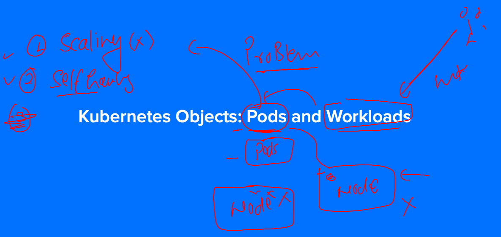
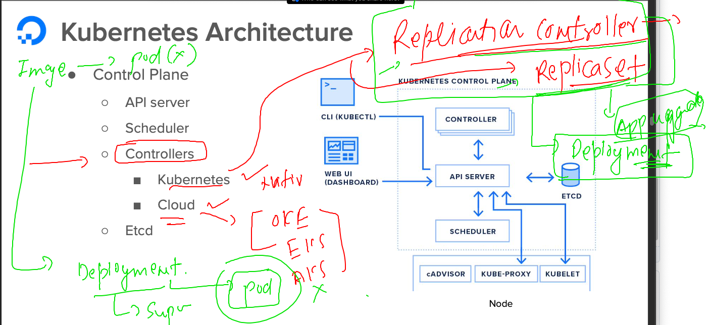
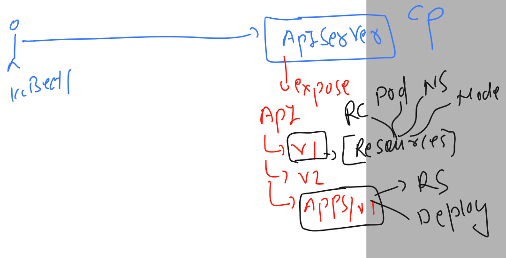

## Revision of k8s 


### verify connection and namespace 

```
ashu@ip-172-31-31-88 ashu-images]$ kubectl  get  nodes
NAME      STATUS   ROLES           AGE   VERSION
master    Ready    control-plane   14h   v1.27.1
minion1   Ready    <none>          14h   v1.27.1
minion2   Ready    <none>          14h   v1.27.1
[ashu@ip-172-31-31-88 ashu-images]$ kubectl  get  ns
NAME               STATUS   AGE
ashu-deploy        Active   14h
default            Active   14h
hema-deploy        Active   14h
ishan-deploy       Active   14h
kube-node-lease    Active   14h
kube-public        Active   14h
kube-system        Active   14h
naveen-deploy-ns   Active   14h
ravinder-ns        Active   14h
saivisal-deploy    Active   14h
sat-namespace      Active   14h
t-ns               Active   14h
tasks              Active   14h
[ashu@ip-172-31-31-88 ashu-images]$ kubectl config set-context --current --namespace ashu-deploy 
Context "kubernetes-admin@kubernetes" modified.
[ashu@ip-172-31-31-88 ashu-images]$ kubectl config get-contexts 
CURRENT   NAME                          CLUSTER      AUTHINFO           NAMESPACE
*         kubernetes-admin@kubernetes   kubernetes   kubernetes-admin   ashu-deploy
[ashu@ip-172-31-31-88 ashu-images]$ 

```

### k8s internal component are deployed in kube-system namespace 

```
ashu@ip-172-31-31-88 ashu-images]$ kubectl  get po -n kube-system    
NAME                                       READY   STATUS    RESTARTS      AGE
calico-kube-controllers-6c99c8747f-8plm9   1/1     Running   1 (44m ago)   14h
calico-node-c49mv                          1/1     Running   1 (44m ago)   14h
calico-node-jbkdc                          1/1     Running   1 (44m ago)   14h
calico-node-sm79b                          1/1     Running   1 (44m ago)   14h
coredns-5d78c9869d-8xn62                   1/1     Running   1 (44m ago)   14h
coredns-5d78c9869d-gh6j2                   1/1     Running   1 (44m ago)   14h
etcd-master                                1/1     Running   1 (44m ago)   14h
kube-apiserver-master                      1/1     Running   1 (44m ago)   14h
kube-controller-manager-master             1/1     Running   1 (44m ago)   14h
kube-proxy-76xgz                           1/1     Running   1 (44m ago)   14h
kube-proxy-t766g                           1/1     Running   1 (44m ago)   14h
kube-proxy-xx4vb                           1/1     Running   1 (44m ago)   14h
kube-scheduler-master                      1/1     Running   1 (44m ago)   14h
```

## java spring app using multi stage dockerfile 


### taking sample spring boot app 

```
ashu@ip-172-31-31-88 ashu-images]$ mkdir  ashu-multistage
[ashu@ip-172-31-31-88 ashu-images]$ ls
ashu-customer  ashu-multistage  ashu-task  ashuwebapp  java  k8s-app-deploy  python
[ashu@ip-172-31-31-88 ashu-images]$ cd ashu-multistage/
[ashu@ip-172-31-31-88 ashu-multistage]$ ls
Dockerfile
[ashu@ip-172-31-31-88 ashu-multistage]$ git clone https://github.com/redashu/java-springboot.git
Cloning into 'java-springboot'...
remote: Enumerating objects: 23, done.
remote: Counting objects: 100% (23/23), done.
remote: Compressing objects: 100% (17/17), done.
remote: Total 23 (delta 4), reused 0 (delta 0), pack-reused 0
Receiving objects: 100% (23/23), 5.62 KiB | 1.12 MiB/s, done.
Resolving deltas: 100% (4/4), done.
[ashu@ip-172-31-31-88 ashu-multistage]$ ls
Dockerfile  java-springboot
[ashu@ip-172-31-31-88 ashu-multistage]$ 


```

### Dockerfile 

```
from oraclelinux:8.4  as Stage1 
LABEL name=ashutoshh
RUN yum install maven java-1.8.0-openjdk.x86_64 java-1.8.0-openjdk-devel.x86_64  -y 
RUN mkdir /myapp
ADD java-springboot  /myapp/
WORKDIR /myapp
RUN mvn clean package 
# above command will build a war file from java spring app 
# it will create target forlder and under that it will create WebApp.war file 
FROM tomcat 
LABEL name=ashutoshh
LABEL email=ashutoshh@linux.com 
COPY --from=Stage1  /myapp/target/WebApp.war /usr/local/tomcat/webapps/
# if we don't use cmd / entrypoint for process definition 
# then your FROM image default cmd / entrypoint will be considered
```

### lets build it 

```
[ashu@ip-172-31-31-88 ashu-multistage]$ ls
Dockerfile  java-springboot
[ashu@ip-172-31-31-88 ashu-multistage]$ docker build  -t  docker.io/dockerashu/oraclespring:ashuv1 . 
Sending build context to Docker daemon  15.36kB
Step 1/11 : from oraclelinux:8.4  as Stage1
 ---> 97e22ab49eea
Step 2/11 : LABEL name=ashutoshh
 ---> Running in 79a509d1e199
Removing intermediate container 79a509d1e199
 ---> e3009e2d1dbc
Step 3/11 : RUN yum install maven java-1.8.0-openjdk.x86_64 java-1.8.0-openjdk-devel.x86_64  -y
 ---> Running in a5d313b9fec9
Oracle Linux 8 BaseOS Latest (x86_64)            70 MB/s |  57 MB     00:00    

```

### checking image

```
[ashu@ip-172-31-31-88 ashu-multistage]$ docker images  | grep dockerashu
dockerashu/oraclespring              ashuv1    3c97cea4df5d   22 seconds ago       475MB
dockerashu/ashucimg                  v007      d4d0377464d5   42 hours ago         526MB
```

### pushing 

```
[ashu@ip-172-31-31-88 ashu-multistage]$ docker login 
Authenticating with existing credentials...
WARNING! Your password will be stored unencrypted in /home/ashu/.docker/config.json.
Configure a credential helper to remove this warning. See
https://docs.docker.com/engine/reference/commandline/login/#credentials-store

Login Succeeded
[ashu@ip-172-31-31-88 ashu-multistage]$ docker push  docker.io/dockerashu/oraclespring:ashuv1
The push refers to repository [docker.io/dockerashu/oraclespring]
f4bc6bcc2c0f: Pushed 
34fa941837a6: Mounted from library/tomcat 
51855650441a: Mounted from library/tomcat 
509ce21d6674: Mounted from library/tomcat 
```

### pushing registry to azure cloud registy 

```
[ashu@ip-172-31-31-88 ashu-multistage]$ docker tag  docker.io/dockerashu/oraclespring:ashuv1   ashutoshh.azurecr.io/oraclespring:ashuv1
[ashu@ip-172-31-31-88 ashu-multistage]$ 
[ashu@ip-172-31-31-88 ashu-multistage]$ 
[ashu@ip-172-31-31-88 ashu-multistage]$ docker  login  ashutoshh.azurecr.io  
Username: ashutoshh
Password: 
WARNING! Your password will be stored unencrypted in /home/ashu/.docker/config.json.
Configure a credential helper to remove this warning. See
https://docs.docker.com/engine/reference/commandline/login/#credentials-store

Login Succeeded
[ashu@ip-172-31-31-88 ashu-multistage]$ docker push  ashutoshh.azurecr.io/oraclespring:ashuv1
The push refers to repository [ashutoshh.azurecr.io/oraclespring]
f4bc6bcc2c0f: Pushed 
34fa941837a6: Pushed 
51855650441a: Pushed 
```

### PRoblem with POd based app deployment 



## Deployment controller in modern k8s apps 



### api resources understading 



### listing 

```
[ashu@ip-172-31-31-88 ashu-multistage]$ kubectl  api-resources  
NAME                              SHORTNAMES   APIVERSION                             NAMESPACED   KIND
bindings                                       v1                                     true         Binding
componentstatuses                 cs           v1                                     false        ComponentStatus
configmaps                        cm           v1                                     true         ConfigMap
```

### creating deployment yaml 

```
kubectl create deployment  ashu-springapp --image=docker.io/dockerashu/oraclespring:ashuv1   --port 8080  --dry-run=client -o yaml  >deployment1.yaml
```

### yaml show

```
apiVersion: apps/v1
kind: Deployment
metadata:
  creationTimestamp: null
  labels:
    app: ashu-springapp
  name: ashu-springapp # name of deployment 
  namespace: ashu-deploy # optional step 
spec:
  replicas: 1 # min number of pod we require 
  selector:
    matchLabels:
      app: ashu-springapp
  strategy: {}
  template: # for pod info 
    metadata:
      creationTimestamp: null
      labels:
        app: ashu-springapp
    spec:
      containers:
      - image: docker.io/dockerashu/oraclespring:ashuv1
        name: oraclespring
        ports:
        - containerPort: 8080
        resources: {}
status: {}

```

### checking this 

```
ashu@ip-172-31-31-88 k8s-app-deploy]$ ls
app1.yaml  ashupod1.yaml  autopod.yaml  autopod1.json  deployment1.yaml  hello.yaml  task.yaml
[ashu@ip-172-31-31-88 k8s-app-deploy]$ kubectl  apply -f  deployment1.yaml 
deployment.apps/ashu-springapp created
[ashu@ip-172-31-31-88 k8s-app-deploy]$ kubectl  get  deploy 
NAME             READY   UP-TO-DATE   AVAILABLE   AGE
ashu-springapp   0/1     1            0           7s
[ashu@ip-172-31-31-88 k8s-app-deploy]$ kubectl  get  rs
NAME                        DESIRED   CURRENT   READY   AGE
ashu-springapp-67687989c9   1         1         1       13s
[ashu@ip-172-31-31-88 k8s-app-deploy]$ kubectl  get   po 
NAME                              READY   STATUS    RESTARTS   AGE
ashu-springapp-67687989c9-ln4b5   1/1     Running   0          17s
[ashu@ip-172-31-31-88 k8s-app-deploy]$ 

```

### self healing 

```
[ashu@ip-172-31-31-88 k8s-app-deploy]$ kubectl  get po  -o wide
NAME                              READY   STATUS    RESTARTS   AGE     IP             NODE      NOMINATED NODE   READINESS GATES
ashu-springapp-67687989c9-ln4b5   1/1     Running   0          2m51s   192.168.34.1   minion1   <none>           <none>
[ashu@ip-172-31-31-88 k8s-app-deploy]$ 
[ashu@ip-172-31-31-88 k8s-app-deploy]$ 
[ashu@ip-172-31-31-88 k8s-app-deploy]$ kubectl delete pod ashu-springapp-67687989c9-ln4b5 
pod "ashu-springapp-67687989c9-ln4b5" deleted
[ashu@ip-172-31-31-88 k8s-app-deploy]$ kubectl  get po  -o wide
NAME                              READY   STATUS    RESTARTS   AGE   IP             NODE      NOMINATED NODE   READINESS GATES
ashu-springapp-67687989c9-ksvdz   1/1     Running   0          4s    192.168.34.4   minion1   <none>           <none>
[ashu@ip-172-31-31-88 k8s-app-deploy]$ 

```

### scaling pod 

```
[ashu@ip-172-31-31-88 k8s-app-deploy]$ kubectl  get  deploy 
NAME             READY   UP-TO-DATE   AVAILABLE   AGE
ashu-springapp   1/1     1            1           3m49s
[ashu@ip-172-31-31-88 k8s-app-deploy]$ kubectl scale deployment  ashu-springapp  --replicas 3
deployment.apps/ashu-springapp scaled
[ashu@ip-172-31-31-88 k8s-app-deploy]$ kubectl  get po  -o wide
NAME                              READY   STATUS    RESTARTS   AGE   IP                NODE      NOMINATED NODE   READINESS GATES
ashu-springapp-67687989c9-fpgpk   1/1     Running   0          5s    192.168.179.198   minion2   <none>           <none>
ashu-springapp-67687989c9-ksvdz   1/1     Running   0          58s   192.168.34.4      minion1   <none>           <none>
ashu-springapp-67687989c9-stk7c   1/1     Running   0          5s    192.168.179.199   minion2   <none>           <none>
[ashu@ip-172-31-31-88 k8s-app-deploy]$ kubectl scale deployment  ashu-springapp  --replicas 1
deployment.apps/ashu-springapp scaled
[ashu@ip-172-31-31-88 k8s-app-deploy]$ kubectl  get po  -o wide
NAME                              READY   STATUS    RESTARTS   AGE   IP             NODE      NOMINATED NODE   READINESS GATES
ashu-springapp-67687989c9-ksvdz   1/1     Running   0          77s   192.168.34.4   minion1   <none>           <none>
[ashu@ip-172-31-31-88 k8s-app-deploy]$ 

```


