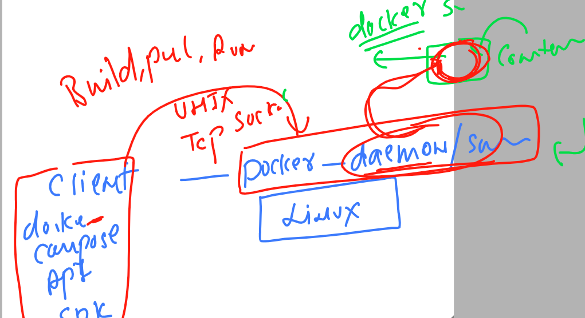
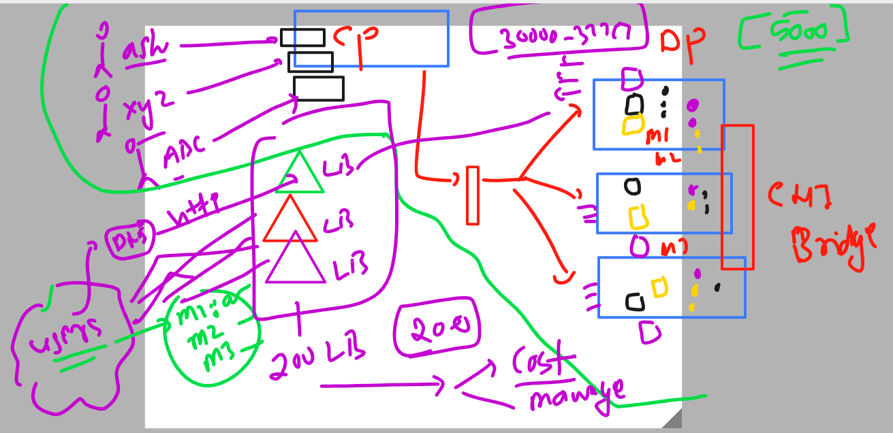
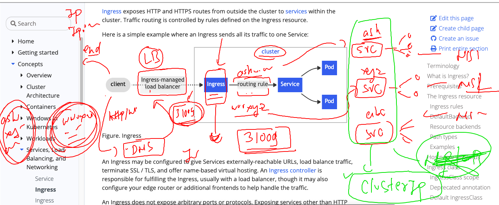
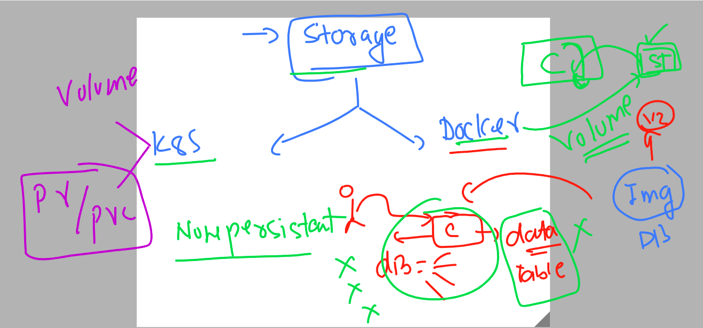
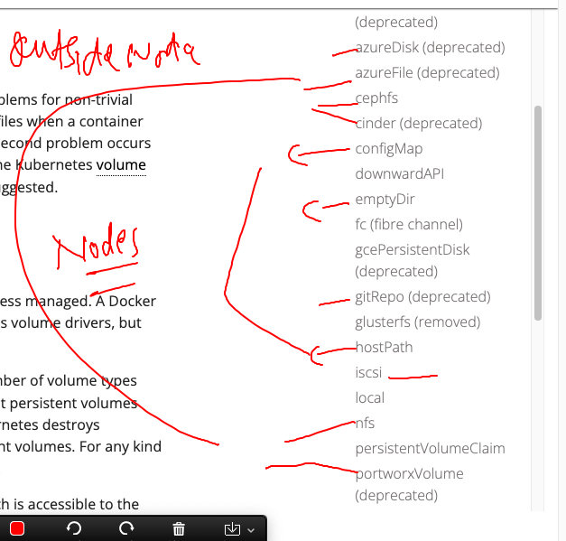

##

### Docker inside a running container 



### docker web ui 

```
root@ip-172-31-31-88 ~]# docker run -itd --name monitor -p 9000:9000 -v /var/run/docker.sock:/var/run/docker.sock portainer/portainer 
Unable to find image 'portainer/portainer:latest' locally
latest: Pulling from portainer/portainer
772227786281: Pull complete 
96fd13befc87: Pull complete 
0bad1d247b5b: Pull complete 
b5d1b01b1d39: Pull complete 
Digest: sha256:47b064434edf437badf7337e516e07f64477485c8ecc663ddabbe824b20c672d
Status: Downloaded newer image for portainer/portainer:latest
52fecbc4b3718c3e253b3a84f2b56b177c6d231c375a5a38f3045eba632d0698
[root@ip-172-31-31-88 ~]# docker ps
CONTAINER ID   IMAGE                 COMMAND                CREATED         STATUS             PORTS                                                           NAMES
52fecbc4b371   portainer/portainer   "/portainer"           2 minutes ago   Up 2 minutes       8000/tcp, 9443/tcp, 0.0.0.0:9000->9000/tcp, :::9000->9000/tcp   monitor

```


### problem with Loadbalancer 



### Ingress controller 



## Deploy application and explose using ingress controller 

```
[ashu@ip-172-31-31-88 ingress-using-deployment]$ kubectl  create  deployment ashu-ui --image=dockerashu/ashu-customer:v1  --port 80 --dry-run=client -o yaml >deployment.yaml 
[ashu@ip-172-31-31-88 ingress-using-deployment]$ ls
deployment.yaml
```

### using configMap to store variabels and values 

```
[ashu@ip-172-31-31-88 ingress-using-deployment]$ kubectl create configmap ashu-app-vars --from-
--from-env-file  --from-file      --from-literal   
[ashu@ip-172-31-31-88 ingress-using-deployment]$ kubectl create configmap ashu-app-vars --from-literal  app1=hello --from-literal app2=world --dry-run=client -o yaml >ashucm.yaml 
[ashu@ip-172-31-31-88 ingress-using-deployment]$ kubectl apply -f ashucm.yaml 
configmap/ashu-app-vars created
[ashu@ip-172-31-31-88 ingress-using-deployment]$ kubectl  get  cm 
NAME               DATA   AGE
ashu-app-vars      2      4s
kube-root-ca.crt   1      38h
[ashu@ip-172-31-31-88 ingress-using-deployment]$ 


```

### using configmap just to store variable and then callinside deployment file 

```
apiVersion: apps/v1
kind: Deployment
metadata:
  creationTimestamp: null
  labels:
    app: ashu-ui
  name: ashu-ui
spec:
  replicas: 1
  selector:
    matchLabels:
      app: ashu-ui
  strategy: {}
  template: # pod template section 
    metadata:
      creationTimestamp: null
      labels:
        app: ashu-ui
    spec:
      containers:
      - image: dockerashu/ashu-customer:v1
        name: ashu-customer
        ports:
        - containerPort: 80
        env: # calling / creat env 
        - name: deploy # name of orginal variable 
          valueFrom:
            configMapKeyRef: # calling configmap 
              name: ashu-app-vars
              key: app1 
        resources: {}
status: {}

```

### Deploy 

```
[ashu@ip-172-31-31-88 ingress-using-deployment]$ ls
ashucm.yaml  deployment.yaml
[ashu@ip-172-31-31-88 ingress-using-deployment]$ kubectl apply -f deployment.yaml 
deployment.apps/ashu-ui created
[ashu@ip-172-31-31-88 ingress-using-deployment]$ kubectl  get deploy 
NAME      READY   UP-TO-DATE   AVAILABLE   AGE
ashu-ui   0/1     1            0           4s
[ashu@ip-172-31-31-88 ingress-using-deployment]$ kubectl  get po
NAME                       READY   STATUS              RESTARTS   AGE
ashu-ui-5b758b774f-9r2wv   0/1     ContainerCreating   0          9s
[ashu@ip-172-31-31-88 ingress-using-deployment]$ kubectl  get po
NAME                       READY   STATUS    RESTARTS   AGE
ashu-ui-5b758b774f-9r2wv   1/1     Running   0          11s
[ashu@ip-172-31-31-88 ingress-using-deployment]$ 

```
### creating service 

```
[ashu@ip-172-31-31-88 ingress-using-deployment]$ ls
ashucm.yaml  deployment.yaml
[ashu@ip-172-31-31-88 ingress-using-deployment]$ kubectl  get deploy 
NAME      READY   UP-TO-DATE   AVAILABLE   AGE
ashu-ui   1/1     1            1           7m57s
[ashu@ip-172-31-31-88 ingress-using-deployment]$ kubectl  expose deployment ashu-ui --type ClusterIP --port 1234 --target-port 80 --name lb1  --dry-run=client -o yaml >svc.yaml 
[ashu@ip-172-31-31-88 ingress-using-deployment]$ kubectl apply -f svc.yaml 
service/lb1 created
[ashu@ip-172-31-31-88 ingress-using-deployment]$ kubectl  get  svc
NAME   TYPE        CLUSTER-IP    EXTERNAL-IP   PORT(S)    AGE
lb1    ClusterIP   10.99.85.52   <none>        1234/TCP   2s
[ashu@ip-172-31-31-88 ingress-using-deployment]$ 


```
## Deploy nginx ingress controller 

```
[ashu@ip-172-31-31-88 ~]$ kubectl apply -f https://raw.githubusercontent.com/kubernetes/ingress-nginx/main/deploy/static/provider/baremetal/deploy.yaml
namespace/ingress-nginx created
serviceaccount/ingress-nginx created
serviceaccount/ingress-nginx-admission created
role.rbac.authorization.k8s.io/ingress-nginx created
role.rbac.authorization.k8s.io/ingress-nginx-admission created
clusterrole.rbac.authorization.k8s.io/ingress-nginx created
clusterrole.rbac.authorization.k8s.io/ingress-nginx-admission created
rolebinding.rbac.authorization.k8s.io/ingress-nginx created
rolebinding.rbac.authorization.k8s.io/ingress-nginx-admission created
clusterrolebinding.rbac.authorization.k8s.io/ingress-nginx created
clusterrolebinding.rbac.authorization.k8s.io/ingress-nginx-admission created
configmap/ingress-nginx-controller created
service/ingress-nginx-controller create
```

### verify it 

```
[ashu@ip-172-31-31-88 ~]$ kubectl  get  po -n ingress-nginx 
NAME                                        READY   STATUS      RESTARTS   AGE
ingress-nginx-admission-create-vmxx9        0/1     Completed   0          49s
ingress-nginx-admission-patch-x7x5k         0/1     Completed   1          49s
ingress-nginx-controller-5f49cfd9f9-xvc9j   1/1     Running     0          49s
[ashu@ip-172-31-31-88 ~]$ 
[ashu@ip-172-31-31-88 ~]$ kubectl  get  svc  -n ingress-nginx 
NAME                                 TYPE        CLUSTER-IP       EXTERNAL-IP   PORT(S)                      AGE
ingress-nginx-controller             NodePort    10.105.121.174   <none>        80:31099/TCP,443:30157/TCP   57s
ingress-nginx-controller-admission   ClusterIP   10.100.9.241     <none>        443/TCP                      57s
[ashu@ip-172-31-31-88 ~]$ 


```

### creating ingress routing rule in my namespace 

```
apiVersion: networking.k8s.io/v1
kind: Ingress
metadata:
  name: ashu-app-rule
  annotations:
    nginx.ingress.kubernetes.io/rewrite-target: /
spec:
  ingressClassName: nginx # class name -- using nginx 
  rules:
  - host: jaipur.ashutoshh.in 
    http:
      paths:
      - path: / # home path of my app 
        pathType: Prefix
        backend:
          service: # service details 
            name: lb1
            port:
              number: 1234
```

### Deploy it

```
[ashu@ip-172-31-31-88 ingress-using-deployment]$ kubectl apply -f ingress.yaml 
ingress.networking.k8s.io/ashu-app-rule created
[ashu@ip-172-31-31-88 ingress-using-deployment]$ kubectl  get ingress
NAME            CLASS   HOSTS                 ADDRESS   PORTS   AGE
ashu-app-rule   nginx   jaipur.ashutoshh.in             80      4s
[ashu@ip-172-31-31-88 ingress-using-deployment]$ 


```

## Introduction to storage in docker and k8s 



### creating database container without storage

```
[ashu@ip-172-31-31-88 ~]$ docker run -d --name ashudb1 -e MYSQL_ROOT_PASSWORD="K8s@098#" mysql 
f1493a153ecb3871fef2cfac11139d895986b89cef2918fa8b342e63e9143c52
[ashu@ip-172-31-31-88 ~]$ docker ps
CONTAINER ID   IMAGE     COMMAND                  CREATED         STATUS         PORTS                 NAMES
f1493a153ecb   mysql     "docker-entrypoint.s…"   4 seconds ago   Up 3 seconds   3306/tcp, 33060/tcp   ashudb1
[ashu@ip-172-31-31-88 ~]$ docker logs  ashudb1
2023-04-21 06:36:46+00:00 [Note] [Entrypoint]: Entrypoint script for MySQL Server 8.0.33-1.el8 started.
2023-04-21 06:36:46+00:00 [Note] [Entrypoint]: Switching to dedicated user 'mysql'
2023-04-21 06:36:46+00:00 [Note] [Entrypoint]: Entrypoint script for MySQL Server 8.0.33-1.el8 started.
2023-04-21 06:36:46+00:00 [Note] [Entrypoint]: Initializing database files
2023-04-21T06:36:46.510781Z 0 [Warning] [MY-011068] [Server] The syntax '--skip-host-cache' is depreca
```

### accessing db 

```
ashu@ip-172-31-31-88 ~]$ docker exec -it ashudb1 bash 
bash-4.4# 
bash-4.4# 
bash-4.4# mysql -u root -p
Enter password: 
Welcome to the MySQL monitor.  Commands end with ; or \g.
Your MySQL connection id is 8
Server version: 8.0.33 MySQL Community Server - GPL

Copyright (c) 2000, 2023, Oracle and/or its affiliates.

Oracle is a registered trademark of Oracle Corporation and/or its
affiliates. Other names may be trademarks of their respective
owners.

Type 'help;' or '\h' for help. Type '\c' to clear the current input statement.

mysql> show databases;
+--------------------+
| Database           |
+--------------------+
| information_schema |
| mysql              |
| performance_schema |
| sys                |
+--------------------+
4 rows in set (0.00 sec)

mysql> create database hello;
Query OK, 1 row affected (0.00 sec)

mysql> show databases;
+--------------------+
| Database           |
+--------------------+
| hello              |
| information_schema |
| mysql              |
| performance_schema |
| sys                |
+--------------------+
5 rows in set (0.00 sec)

mysql> exit;
Bye
bash-4.4# exit
exit
```

### using docker volumes to create storage

```
[ashu@ip-172-31-31-88 ~]$ docker volume  create ashudb-vol1
ashudb-vol1
[ashu@ip-172-31-31-88 ~]$ docker volume inspect ashudb-vol1
[
    {
        "CreatedAt": "2023-04-21T06:40:42Z",
        "Driver": "local",
        "Labels": {},
        "Mountpoint": "/var/lib/docker/volumes/ashudb-vol1/_data",
        "Name": "ashudb-vol1",
        "Options": {},
        "Scope": "local"
    }
]
```

### using volume in mysql container 

```
[ashu@ip-172-31-31-88 ~]$ docker run -d --name ashudb1 -e MYSQL_ROOT_PASSWORD="K8s@098#"    -v ashudb-vol1:/var/lib/mysql/:rw          mysql 
86371314514b8093f78d4be42d594791d962ad524edf67cafa5b4b501740fc6a
[ashu@ip-172-31-31-88 ~]$ 
[ashu@ip-172-31-31-88 ~]$ docker  exec -it ashudb1 bash 
bash-4.4# mysql -u root -p
Enter password: 
Welcome to the MySQL monitor.  Commands end with ; or \g.
Your MySQL connection id is 8
Server version: 8.0.33 MySQL Community Server - GPL

Copyright (c) 2000, 2023, Oracle and/or its affiliates.

Oracle is a registered trademark of Oracle Corporation and/or its
affiliates. Other names may be trademarks of their respective
owners.

Type 'help;' or '\h' for help. Type '\c' to clear the current input statement.

mysql> show databases;
+--------------------+
| Database           |
+--------------------+
| hello              |
| information_schema |
| mysql              |
| oracle             |
| performance_schema |
| sys                |
+--------------------+
6 rows in set (0.00 sec)

mysql> ^DBye
bash-4.4# exit
```
### 

```
[ashu@ip-172-31-31-88 ~]$ 
[ashu@ip-172-31-31-88 ~]$ 
[ashu@ip-172-31-31-88 ~]$ docker volume ls
DRIVER    VOLUME NAME
local     5fb04ea878eb0cd9010a08bee8aa793e2946161b41a0d9163df254064c268622
local     ashudb-vol1
local     dc5668f7344a2e1706e69a15b393e89eb527b4d8722e200e4f4d56e715374a5f
local     e3b3a99e8ed71def18daca8f3b86a545dd6e2500754356b405e74eb0670ad9ab
local     e4d05a3467a074a2f18e2a70698c4a2bb7cd334b7b07be3932ed9180a7120f92
[ashu@ip-172-31-31-88 ~]$ docker volume prune
WARNING! This will remove all local volumes not used by at least one container.
Are you sure you want to continue? [y/N] y
Deleted Volumes:
e3b3a99e8ed71def18daca8f3b86a545dd6e2500754356b405e74eb0670ad9ab
e4d05a3467a074a2f18e2a70698c4a2bb7cd334b7b07be3932ed9180a7120f92
5fb04ea878eb0cd9010a08bee8aa793e2946161b41a0d9163df254064c268622
dc5668f7344a2e1706e69a15b393e89eb527b4d8722e200e4f4d56e715374a5f
ashudb-vol1

Total reclaimed space: 628.2MB
[ashu@ip-172-31-31-88 ~]$ 


```

### using secret for database password storage purpose 

```
apiVersion: apps/v1
kind: Deployment
metadata:
  creationTimestamp: null
  labels:
    app: mydep1
  name: mydep1
spec:
  replicas: 1
  selector:
    matchLabels:
      app: mydep1
  strategy: {}
  template:
    metadata:
      creationTimestamp: null
      labels:
        app: mydep1
    spec:
      containers:
      - image: mysql:5.6
        name: mysql
        ports:
        - containerPort: 3306
        env: 
        - name: MYSQL_ROOT_PASSWORD
          valueFrom:
            secretKeyRef:
              name: db-pass
              key: appx
        resources: {}
status: {}

```

### k8s volume can take storage from two type of location 



### mysql Deployment using hostPath volume 

```
apiVersion: apps/v1
kind: Deployment
metadata:
  creationTimestamp: null
  labels:
    app: mydep1
  name: mydep1
spec:
  replicas: 1
  selector:
    matchLabels:
      app: mydep1
  strategy: {}
  template: # template 
    metadata:
      creationTimestamp: null
      labels:
        app: mydep1
    spec:
      volumes: # creating volume 
      - name: ashudb-vol1 
        hostPath: # this will take storge from Minion node where pod will be running 
          path: /opt/ashu-data
          type: DirectoryOrCreate # if not present then create this directory in node 
      containers:
      - image: mysql:5.6
        name: mysql
        ports:
        - containerPort: 3306
        volumeMounts: # for attaching volume to the container 
        - name: ashudb-vol1  # name of volume we created above 
          mountPath: /var/lib/mysql/ # locaiton where to attach 
        env: 
        - name: MYSQL_ROOT_PASSWORD
          valueFrom:
            secretKeyRef:
              name: db-pass
              key: appx
        resources: {}
status: {}

```

### using deployment 

```
[ashu@ip-172-31-31-88 k8s-app-deploy]$ kubectl apply -f secre22.yaml  -f mysql.yaml  
secret/db-pass configured
deployment.apps/mydep1 created
[ashu@ip-172-31-31-88 k8s-app-deploy]$ kubectl  get secrets 
NAME           TYPE                             DATA   AGE
ashu-img-sec   kubernetes.io/dockerconfigjson   1      22h
db-pass        Opaque                           1      14m
[ashu@ip-172-31-31-88 k8s-app-deploy]$ kubectl  get deploy 
NAME     READY   UP-TO-DATE   AVAILABLE   AGE
mydep1   1/1     1            1           12s
[ashu@ip-172-31-31-88 k8s-app-deploy]$ kubectl  get po 
NAME                      READY   STATUS    RESTARTS   AGE
mydep1-7ddfff8475-bbmgw   1/1     Running   0          19s
[ashu@ip-172-31-31-88 k8s-app-deploy]$ 

```


